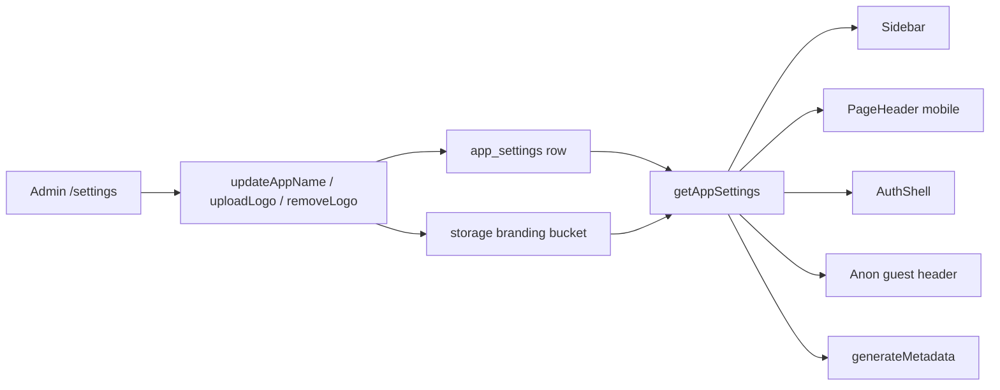

# Admin Branding Implementation Plan

> **For agentic workers:** REQUIRED SUB-SKILL: Use superpowers:subagent-driven-development (recommended) or superpowers:executing-plans to implement this plan task-by-task. Steps use checkbox (`- [ ]`) syntax for tracking.

**Goal:** Admins can change the portal name and header logo from one `/settings` page; every signed-out and signed-in chrome surface shows the current values.

**Architecture:** A singleton `app_settings` row (public read, admin write) plus a public Supabase Storage bucket `branding`. Server actions use the existing `requireRole(["admin"])` + `createAdminClient()` pattern. A shared `BrandLockup` reads `{ app_name, logo_url }` and is passed down from server layouts/pages. TOTP issuer stays `halfAccessible` so existing authenticator entries keep working.

**Tech Stack:** Next.js 15 App Router, Supabase Postgres + Storage, Vitest, Playwright, existing Button/TextField/Toast primitives.

## Global Constraints

- First signup is already admin via `roleForNewUser(0)` in [lib/auth/firstUser.ts](lib/auth/firstUser.ts). Do not add a `super_admin` role. `/settings` is `admin` only, same as `/users`.
- One portal config route: `/settings`. This plan only adds name + logo. Structure the page so later config sections can be added on the same route.
- Brand surfaces: sidebar, mobile PageHeader, AuthShell (login/signup), guest anon header, `document.title`. Not the login headline, manifesto, or tagline.
- Do not change `TOTP_ISSUER` in [lib/totp/verify.ts](lib/totp/verify.ts).
- Default name is `halfAccessible`. No logo until one is uploaded. Removing the logo returns to text-only.
- Logo: `image/png`, `image/jpeg`, `image/webp`, `image/svg+xml`. Max 1 MB. Render with `` (not inline SVG).
- Voice stays lowercase / casual, matching `/users`.
- Honor `prefers-reduced-motion`. Light theme only.
- Save a copy of this plan to `docs/superpowers/plans/2026-08-14-admin-branding.md` as the first execution step.



## File map

- Create: `docs/superpowers/plans/2026-08-14-admin-branding.md`
- Create: `supabase/migrations/0003_app_settings.sql`
- Create: `lib/branding/validate.ts`, `lib/branding/validate.test.ts`
- Create: `lib/branding/settings.ts`, `lib/branding/settings.test.ts`
- Create: `components/layout/BrandLockup.tsx`, `components/layout/BrandLockup.module.scss`
- Create: `app/(portal)/settings/page.tsx`, `app/(portal)/settings/actions.ts`
- Create: `components/settings/SettingsClient.tsx`
- Create: `e2e/settings.spec.ts`
- Modify: [lib/types.ts](lib/types.ts), [lib/rls/policies.ts](lib/rls/policies.ts), [supabase/tests/rls.test.ts](supabase/tests/rls.test.ts)
- Modify: [lib/layout/navItems.ts](lib/layout/navItems.ts), [components/layout/navItems.test.ts](components/layout/navItems.test.ts)
- Modify: [app/(portal)/layout.tsx](app/(portal)/layout.tsx), [components/layout/AppShell.tsx](components/layout/AppShell.tsx), [components/layout/Sidebar.tsx](components/layout/Sidebar.tsx), [components/layout/PageHeader.tsx](components/layout/PageHeader.tsx), [components/layout/MobileNav.tsx](components/layout/MobileNav.tsx)
- Modify: [components/layout/Sidebar.module.scss](components/layout/Sidebar.module.scss), [components/layout/PageHeader.module.scss](components/layout/PageHeader.module.scss)
- Modify: [components/layout/AuthShell.tsx](components/layout/AuthShell.tsx), [app/login/page.tsx](app/login/page.tsx), [app/login/LoginFlow.tsx](app/login/LoginFlow.tsx), [app/signup/page.tsx](app/signup/page.tsx), [app/signup/SignupFlow.tsx](app/signup/SignupFlow.tsx)
- Modify: [app/anon/page.tsx](app/anon/page.tsx), [app/layout.tsx](app/layout.tsx)
- Modify: [supabase/config.toml](supabase/config.toml) branding bucket

---

### Task 1: Copy the plan

**Files:**
- Create: `docs/superpowers/plans/2026-08-14-admin-branding.md`

- [ ] **Step 1: Save the approved plan**

Copy this plan into that path so later sessions can execute from disk.

- [ ] **Step 2: Commit**

```bash
git add docs/superpowers/plans/2026-08-14-admin-branding.md
git commit -m "docs: add admin branding implementation plan"
```

---

### Task 2: Name and logo validation

**Files:**
- Create: `lib/branding/validate.ts`
- Test: `lib/branding/validate.test.ts`

**Interfaces:**
- Consumes: nothing
- Produces: `APP_NAME_MAX`, `LOGO_MAX_BYTES`, `LOGO_MIME_TYPES`, `validateAppName(name: string): string | null`, `validateLogoFile(file: { type: string; size: number }): string | null`, `logoExtension(mime: string): string | null`

- [ ] **Step 1: Write the failing test**

```ts
import { describe, expect, it } from "vitest";
import {
  APP_NAME_MAX,
  LOGO_MAX_BYTES,
  logoExtension,
  validateAppName,
  validateLogoFile,
} from "./validate";

describe("branding validation", () => {
  it("requires a trimmed name of 1 to APP_NAME_MAX chars", () => {
    expect(validateAppName("")).toBe("name required");
    expect(validateAppName("   ")).toBe("name required");
    expect(validateAppName("x".repeat(APP_NAME_MAX + 1))).toBe("name too long");
    expect(validateAppName("  halfAccessible  ")).toBeNull();
  });

  it("accepts png jpeg webp svg under 1MB", () => {
    expect(validateLogoFile({ type: "image/png", size: 12 })).toBeNull();
    expect(validateLogoFile({ type: "image/gif", size: 12 })).toBe("unsupported file type");
    expect(validateLogoFile({ type: "image/png", size: 0 })).toBe("empty file");
    expect(validateLogoFile({ type: "image/png", size: LOGO_MAX_BYTES + 1 })).toBe(
      "file too large",
    );
  });

  it("maps mime types to extensions", () => {
    expect(logoExtension("image/jpeg")).toBe("jpg");
    expect(logoExtension("image/svg+xml")).toBe("svg");
    expect(logoExtension("image/gif")).toBeNull();
  });
});
```

- [ ] **Step 2: Run test to verify it fails**

Run: `npx vitest run lib/branding/validate.test.ts`
Expected: FAIL with "Cannot find module"

- [ ] **Step 3: Write minimal implementation**

```ts
export const APP_NAME_MAX = 40;
export const LOGO_MAX_BYTES = 1_048_576;
export const LOGO_MIME_TYPES = [
  "image/png",
  "image/jpeg",
  "image/webp",
  "image/svg+xml",
] as const;

const EXT: Record<(typeof LOGO_MIME_TYPES)[number], string> = {
  "image/png": "png",
  "image/jpeg": "jpg",
  "image/webp": "webp",
  "image/svg+xml": "svg",
};

export function validateAppName(name: string): string | null {
  const t = name.trim();
  if (!t) return "name required";
  if (t.length > APP_NAME_MAX) return "name too long";
  return null;
}

export function validateLogoFile(file: { type: string; size: number }): string | null {
  if (!LOGO_MIME_TYPES.includes(file.type as (typeof LOGO_MIME_TYPES)[number])) {
    return "unsupported file type";
  }
  if (file.size <= 0) return "empty file";
  if (file.size > LOGO_MAX_BYTES) return "file too large";
  return null;
}

export function logoExtension(mime: string): string | null {
  return EXT[mime as (typeof LOGO_MIME_TYPES)[number]] ?? null;
}
```

- [ ] **Step 4: Run test to verify it passes**

Run: `npx vitest run lib/branding/validate.test.ts`
Expected: PASS

- [ ] **Step 5: Commit**

```bash
git add lib/branding/validate.ts lib/branding/validate.test.ts
git commit -m "feat: validate portal name and logo uploads"
```

---

### Task 3: Settings reader and logo URL

**Files:**
- Create: `lib/branding/settings.ts`
- Test: `lib/branding/settings.test.ts`
- Modify: [lib/types.ts](lib/types.ts) — add `AppSettings`

**Interfaces:**
- Consumes: `validateAppName` is not used here
- Produces: `DEFAULT_APP_NAME = "halfAccessible"`, `AppSettings`, `logoPublicUrl(path: string | null): string | null`, `normalizeSettings(row: { app_name?: string | null; logo_path?: string | null } | null): AppSettings`, `getAppSettings(): Promise<AppSettings>`

- [ ] **Step 1: Write the failing test**

```ts
import { afterEach, describe, expect, it } from "vitest";
import { DEFAULT_APP_NAME, logoPublicUrl, normalizeSettings } from "./settings";

describe("branding settings", () => {
  const prev = process.env.NEXT_PUBLIC_SUPABASE_URL;
  afterEach(() => {
    process.env.NEXT_PUBLIC_SUPABASE_URL = prev;
  });

  it("falls back to halfAccessible and no logo", () => {
    expect(normalizeSettings(null)).toEqual({
      app_name: DEFAULT_APP_NAME,
      logo_path: null,
      logo_url: null,
    });
    expect(normalizeSettings({ app_name: "  ", logo_path: null }).app_name).toBe(
      DEFAULT_APP_NAME,
    );
  });

  it("builds a public storage URL", () => {
    process.env.NEXT_PUBLIC_SUPABASE_URL = "http://127.0.0.1:54321/";
    expect(logoPublicUrl("logo-ab.png")).toBe(
      "http://127.0.0.1:54321/storage/v1/object/public/branding/logo-ab.png",
    );
    expect(normalizeSettings({ app_name: "Acme", logo_path: "logo-ab.png" })).toEqual({
      app_name: "Acme",
      logo_path: "logo-ab.png",
      logo_url: "http://127.0.0.1:54321/storage/v1/object/public/branding/logo-ab.png",
    });
  });
});
```

- [ ] **Step 2: Run test to verify it fails**

Run: `npx vitest run lib/branding/settings.test.ts`
Expected: FAIL with "Cannot find module"

- [ ] **Step 3: Write types + helpers + reader**

Add to [lib/types.ts](lib/types.ts):

```ts
export type AppSettings = {
  app_name: string;
  logo_path: string | null;
  logo_url: string | null;
};
```

`lib/branding/settings.ts`:

```ts
import { createClient } from "@/lib/supabase/server";
import type { AppSettings } from "@/lib/types";

export const DEFAULT_APP_NAME = "halfAccessible";

export function logoPublicUrl(path: string | null): string | null {
  if (!path) return null;
  const base = process.env.NEXT_PUBLIC_SUPABASE_URL?.replace(/\/$/, "");
  if (!base) return null;
  return `${base}/storage/v1/object/public/branding/${path}`;
}

export function normalizeSettings(
  row: { app_name?: string | null; logo_path?: string | null } | null,
): AppSettings {
  const app_name = row?.app_name?.trim() || DEFAULT_APP_NAME;
  const logo_path = row?.logo_path ?? null;
  return { app_name, logo_path, logo_url: logoPublicUrl(logo_path) };
}

export async function getAppSettings(): Promise<AppSettings> {
  try {
    const supabase = await createClient();
    const { data } = await supabase
      .from("app_settings")
      .select("app_name, logo_path")
      .eq("id", 1)
      .maybeSingle();
    return normalizeSettings(data);
  } catch {
    return normalizeSettings(null);
  }
}
```

- [ ] **Step 4: Run test to verify it passes**

Run: `npx vitest run lib/branding/settings.test.ts`
Expected: PASS

- [ ] **Step 5: Commit**

```bash
git add lib/types.ts lib/branding/settings.ts lib/branding/settings.test.ts
git commit -m "feat: read portal name and logo with safe defaults"
```

---

### Task 4: Migration, storage bucket, RLS contract

**Files:**
- Create: `supabase/migrations/0003_app_settings.sql`
- Modify: [supabase/config.toml](supabase/config.toml) — uncomment/add `[storage.buckets.branding]`
- Modify: [lib/rls/policies.ts](lib/rls/policies.ts)
- Modify: [supabase/tests/rls.test.ts](supabase/tests/rls.test.ts)

**Interfaces:**
- Consumes: existing `is_admin()`
- Produces: `canManageSettings(role: ProfileRole): boolean` (same as `canManageUsers`), table `app_settings`, bucket `branding`

- [ ] **Step 1: Write the failing policy test**

Add to [lib/rls/policies.ts](lib/rls/policies.ts):

```ts
export function canManageSettings(role: ProfileRole): boolean {
  return role === "admin";
}
```

Add to [supabase/tests/rls.test.ts](supabase/tests/rls.test.ts):

```ts
it("only admins change portal settings", () => {
  expect(canManageSettings("employee")).toBe(false);
  expect(canManageSettings("lead")).toBe(false);
  expect(canManageSettings("admin")).toBe(true);
});
```

- [ ] **Step 2: Run test**

Run: `npx vitest run supabase/tests/rls.test.ts`
Expected: FAIL until `canManageSettings` is exported and imported in the test file.

- [ ] **Step 3: Write the migration**

`supabase/migrations/0003_app_settings.sql`:

```sql
create table public.app_settings (
  id smallint primary key default 1 check (id = 1),
  app_name text not null default 'halfAccessible',
  logo_path text,
  updated_at timestamptz not null default now(),
  updated_by uuid references public.profiles (id)
);

insert into public.app_settings (id, app_name) values (1, 'halfAccessible');

alter table public.app_settings enable row level security;

create policy app_settings_select on public.app_settings
  for select to anon, authenticated
  using (true);

create policy app_settings_update on public.app_settings
  for update to authenticated
  using (public.is_admin())
  with check (public.is_admin());

insert into storage.buckets (id, name, public)
values ('branding', 'branding', true)
on conflict (id) do nothing;

create policy branding_public_read
  on storage.objects for select
  to anon, authenticated
  using (bucket_id = 'branding');
```

In [supabase/config.toml](supabase/config.toml) under `[storage]`:

```toml
[storage.buckets.branding]
public = true
file_size_limit = "1MiB"
allowed_mime_types = ["image/png", "image/jpeg", "image/webp", "image/svg+xml"]
```

- [ ] **Step 4: Apply locally if Docker is running**

Run: `npx supabase db reset`
Expected: migration applies. If Docker is not running, leave the file in place; hosted apply happens on push.

- [ ] **Step 5: Commit**

```bash
git add supabase/migrations/0003_app_settings.sql supabase/config.toml lib/rls/policies.ts supabase/tests/rls.test.ts
git commit -m "feat: add app_settings table and public branding bucket"
```

---

### Task 5: Admin server actions

**Files:**
- Create: `app/(portal)/settings/actions.ts`

**Interfaces:**
- Consumes: `requireRole(["admin"])`, `createAdminClient()`, `validateAppName`, `validateLogoFile`, `logoExtension`
- Produces: `updateAppName(formData: FormData): Promise<{ ok: true } | { ok: false; error: string }>`, `uploadLogo(formData: FormData): Promise<{ ok: true } | { ok: false; error: string }>`, `removeLogo(): Promise<{ ok: true } | { ok: false; error: string }>`

- [ ] **Step 1: Implement actions** (logic is covered by validate tests; actions follow [app/(portal)/users/actions.ts](app/(portal)/users/actions.ts))

```ts
"use server";

import { randomBytes } from "node:crypto";
import { revalidatePath } from "next/cache";
import { requireRole } from "@/lib/auth";
import { logoExtension, validateAppName, validateLogoFile } from "@/lib/branding/validate";
import { createAdminClient } from "@/lib/supabase/admin";

function revalidateBrand() {
  revalidatePath("/", "layout");
  revalidatePath("/login");
  revalidatePath("/signup");
  revalidatePath("/anon");
  revalidatePath("/settings");
}

export async function updateAppName(formData: FormData) {
  const me = await requireRole(["admin"]);
  const err = validateAppName(String(formData.get("app_name") ?? ""));
  if (err) return { ok: false as const, error: err };
  const admin = createAdminClient();
  const { error } = await admin
    .from("app_settings")
    .update({
      app_name: String(formData.get("app_name")).trim(),
      updated_at: new Date().toISOString(),
      updated_by: me.id,
    })
    .eq("id", 1);
  if (error) return { ok: false as const, error: error.message };
  revalidateBrand();
  return { ok: true as const };
}

export async function uploadLogo(formData: FormData) {
  const me = await requireRole(["admin"]);
  const file = formData.get("logo");
  if (!(file instanceof File)) return { ok: false as const, error: "file required" };
  const err = validateLogoFile({ type: file.type, size: file.size });
  if (err) return { ok: false as const, error: err };
  const ext = logoExtension(file.type);
  if (!ext) return { ok: false as const, error: "unsupported file type" };

  const admin = createAdminClient();
  const { data: current } = await admin
    .from("app_settings")
    .select("logo_path")
    .eq("id", 1)
    .maybeSingle();

  const path = `logo-${randomBytes(8).toString("hex")}.${ext}`;
  const { error: upErr } = await admin.storage.from("branding").upload(path, file, {
    contentType: file.type,
    upsert: false,
  });
  if (upErr) return { ok: false as const, error: upErr.message };

  const { error } = await admin
    .from("app_settings")
    .update({
      logo_path: path,
      updated_at: new Date().toISOString(),
      updated_by: me.id,
    })
    .eq("id", 1);
  if (error) return { ok: false as const, error: error.message };

  if (current?.logo_path) {
    await admin.storage.from("branding").remove([current.logo_path]);
  }
  revalidateBrand();
  return { ok: true as const };
}

export async function removeLogo() {
  const me = await requireRole(["admin"]);
  const admin = createAdminClient();
  const { data: current } = await admin
    .from("app_settings")
    .select("logo_path")
    .eq("id", 1)
    .maybeSingle();
  if (current?.logo_path) {
    await admin.storage.from("branding").remove([current.logo_path]);
  }
  const { error } = await admin
    .from("app_settings")
    .update({
      logo_path: null,
      updated_at: new Date().toISOString(),
      updated_by: me.id,
    })
    .eq("id", 1);
  if (error) return { ok: false as const, error: error.message };
  revalidateBrand();
  return { ok: true as const };
}
```

- [ ] **Step 2: Commit**

```bash
git add app/(portal)/settings/actions.ts
git commit -m "feat: admin actions to update portal name and logo"
```

---

### Task 6: Settings page and admin nav

**Files:**
- Create: `app/(portal)/settings/page.tsx`
- Create: `components/settings/SettingsClient.tsx`
- Modify: [lib/layout/navItems.ts](lib/layout/navItems.ts)
- Modify: [components/layout/navItems.test.ts](components/layout/navItems.test.ts)
- Modify: [app/(portal)/layout.tsx](app/(portal)/layout.tsx)
- Modify: [components/layout/Sidebar.tsx](components/layout/Sidebar.tsx) icons map
- Modify: [components/layout/MobileNav.tsx](components/layout/MobileNav.tsx) icons map
- Create: `e2e/settings.spec.ts`

**Interfaces:**
- Consumes: `getAppSettings()`, `updateAppName`, `uploadLogo`, `removeLogo`, `requireRole(["admin"])`
- Produces: nav item `{ id: "settings", href: "/settings", label: "portal config", title: "portal config", sub: "name, logo. the face of the portal." }`

- [ ] **Step 1: Update nav tests first**

In [components/layout/navItems.test.ts](components/layout/navItems.test.ts), admins go from 9 items to 10. Employees stay at 8 (no settings, no users).

```ts
it("gives admins 10 items including user management and portal config", () => {
  const items = getNavItems("admin", 2);
  expect(items).toHaveLength(10);
  expect(items.some((i) => i.id === "users")).toBe(true);
  expect(items.some((i) => i.id === "settings")).toBe(true);
});

it("hides portal config from employees", () => {
  expect(getNavItems("employee").some((i) => i.id === "settings")).toBe(false);
});
```

Add `SETTINGS` next to `USERS` in [lib/layout/navItems.ts](lib/layout/navItems.ts):

```ts
const SETTINGS: NavItem = {
  id: "settings",
  href: "/settings",
  label: "portal config",
  title: "portal config",
  sub: "name, logo. the face of the portal.",
};

export function getNavItems(role: ProfileRole, unreadAnnouncements = 0) {
  const items = role === "admin" ? [...BASE, USERS, SETTINGS] : BASE;
  // existing badge map
}
```

Add `settings: GearSix` to the icon maps in Sidebar and MobileNav (`@phosphor-icons/react`).

In [app/(portal)/layout.tsx](app/(portal)/layout.tsx), treat both admin routes the same:

```ts
if ((path === "/users" || path === "/settings") && profile.role !== "admin") redirect("/");
```

- [ ] **Step 2: Settings page**

`app/(portal)/settings/page.tsx`:

```tsx
import { SettingsClient } from "@/components/settings/SettingsClient";
import { requireRole } from "@/lib/auth";
import { getAppSettings } from "@/lib/branding/settings";

export default async function SettingsPage() {
  await requireRole(["admin"]);
  const settings = await getAppSettings();
  return <SettingsClient settings={settings} />;
}
```

`components/settings/SettingsClient.tsx` — one card, same Tailwind card chrome as [components/users/UsersClient.tsx](components/users/UsersClient.tsx):

- Heading `portal config`, helper `name and header logo. this is what people see on the way in.`
- Preview: `<BrandLockup name={settings.app_name} logoUrl={settings.logo_url} />`
- Form 1: `TextField` label `application name` name `app_name` defaultValue `settings.app_name` maxlength 40. Submit calls `updateAppName`. Button `save name`.
- Form 2: native `input type="file" name="logo" accept="image/png,image/jpeg,image/webp,image/svg+xml"`. Hint `png, jpg, webp, or svg. 1 MB max.` Submit calls `uploadLogo`. Button `upload logo`.
- If `settings.logo_url`, ghost button `remove logo` calling `removeLogo`.
- `Toast` on success/error, same pattern as UsersClient.

- [ ] **Step 3: Public e2e guard**

`e2e/settings.spec.ts`:

```ts
import { expect, test } from "@playwright/test";

test("settings page is not public", async ({ page }) => {
  await page.goto("/settings");
  await expect(page).toHaveURL(/login/);
});
```

- [ ] **Step 4: Run unit tests**

Run: `npx vitest run components/layout/navItems.test.ts supabase/tests/rls.test.ts`
Expected: PASS

- [ ] **Step 5: Commit**

```bash
git add lib/layout/navItems.ts components/layout/navItems.test.ts app/(portal)/layout.tsx app/(portal)/settings/page.tsx components/settings/SettingsClient.tsx components/layout/Sidebar.tsx components/layout/MobileNav.tsx e2e/settings.spec.ts
git commit -m "feat: admin portal config page for name and logo"
```

---

### Task 7: BrandLockup in chrome, auth, anon, and tab title

**Files:**
- Create: `components/layout/BrandLockup.tsx`, `components/layout/BrandLockup.module.scss`
- Modify: [components/layout/Sidebar.tsx](components/layout/Sidebar.tsx), [components/layout/AppShell.tsx](components/layout/AppShell.tsx), [components/layout/PageHeader.tsx](components/layout/PageHeader.tsx)
- Modify: [components/layout/Sidebar.module.scss](components/layout/Sidebar.module.scss), [components/layout/PageHeader.module.scss](components/layout/PageHeader.module.scss)
- Modify: [app/(portal)/layout.tsx](app/(portal)/layout.tsx)
- Modify: [components/layout/AuthShell.tsx](components/layout/AuthShell.tsx), [app/login/page.tsx](app/login/page.tsx), [app/login/LoginFlow.tsx](app/login/LoginFlow.tsx), [app/signup/page.tsx](app/signup/page.tsx), [app/signup/SignupFlow.tsx](app/signup/SignupFlow.tsx)
- Modify: [app/anon/page.tsx](app/anon/page.tsx)
- Modify: [app/layout.tsx](app/layout.tsx)

**Interfaces:**
- Consumes: `AppSettings` from `getAppSettings()`
- Produces: `BrandLockup({ name, logoUrl, tagline?: string, size?: "nav" | "auth" | "header" })`

- [ ] **Step 1: BrandLockup**

```tsx
import styles from "./BrandLockup.module.scss";

export function BrandLockup({
  name,
  logoUrl,
  tagline,
  size = "nav",
}: {
  name: string;
  logoUrl: string | null;
  tagline?: string;
  size?: "nav" | "auth" | "header";
}) {
  return (
    <div className={`${styles.brand} ${styles[size]}`}>
      {logoUrl ? (
        // decorative; the visible name is the accessible label
        
      ) : null}
      <div>
        <div className={styles.name}>{name}</div>
        {tagline ? <div className={styles.tag}>{tagline}</div> : null}
      </div>
    </div>
  );
}
```

SCSS: flex row, mark max-height 28px (`nav`/`auth`) or 22px (`header`), object-fit contain. Name uses existing sidebar/auth type (Baloo 2, 20px, `#7463D4` / `$accent-text`).

- [ ] **Step 2: Portal chrome**

[app/(portal)/layout.tsx](app/(portal)/layout.tsx) fetches `const settings = await getAppSettings()` and passes `settings` into `AppShell`.

`AppShell` passes `settings` to `Sidebar` and `PageHeader`.

Replace the hardcoded sidebar block:

```tsx
<div className={styles.brand}>
  <div className={styles.logo}>halfAccessible</div>
  <div className={styles.tag}>the portal ✨ no corporate BS</div>
</div>
```

with:

```tsx
<BrandLockup
  name={settings.app_name}
  logoUrl={settings.logo_url}
  tagline="the portal ✨ no corporate BS"
  size="nav"
/>
```

`PageHeader` on viewports `max-width: 767px` renders a compact `BrandLockup` (`size="header"`, no tagline) above the page title, because the sidebar is `display: none` on mobile. Hide that lockup at `min-width: 768px`.

- [ ] **Step 3: Auth + anon + tab title**

`AuthShell` takes `settings: AppSettings` and replaces `<div className={styles.brand}>halfAccessible</div>` with `<BrandLockup name={settings.app_name} logoUrl={settings.logo_url} size="auth" />`.

Login and signup pages become async server components that call `getAppSettings()` and pass `settings` through `LoginFlow` / `SignupFlow` into `AuthShell`. Keep the existing `<Suspense>` around `LoginFlow`.

Guest branch in [app/anon/page.tsx](app/anon/page.tsx): replace the `halfAccessible` link text with `BrandLockup` (name + optional logo). Keep `href="/"`.

[app/layout.tsx](app/layout.tsx): replace static `metadata` with:

```ts
export async function generateMetadata(): Promise<Metadata> {
  const settings = await getAppSettings();
  return {
    title: `${settings.app_name} portal`,
    description: "the portal. no corporate BS.",
  };
}
```

Do not change the login `<h1>` copy (`the portal. no corporate BS.`) or the auth manifesto.

- [ ] **Step 4: Manual check**

Run: `npm run dev`
- `/login` and `/signup` show default `halfAccessible` (no logo).
- As admin, `/settings` saves a name and a PNG; sidebar, mobile header, login, signup, anon guest header, and the browser tab update after refresh.
- Remove logo returns to text-only.
- Employee visiting `/settings` redirects to `/`.
- Existing TOTP login still works (issuer unchanged).

- [ ] **Step 5: Commit**

```bash
git add components/layout/BrandLockup.tsx components/layout/BrandLockup.module.scss components/layout/Sidebar.tsx components/layout/Sidebar.module.scss components/layout/AppShell.tsx components/layout/PageHeader.tsx components/layout/PageHeader.module.scss components/layout/AuthShell.tsx app/(portal)/layout.tsx app/login/page.tsx app/login/LoginFlow.tsx app/signup/page.tsx app/signup/SignupFlow.tsx app/anon/page.tsx app/layout.tsx
git commit -m "feat: render admin-configured name and logo across chrome"
```

---

## Out of scope

- Changing TOTP issuer / QR labels
- Favicon upload
- Tagline / manifesto editing
- Moving user management onto `/settings`
- A new `super_admin` role

## Spec coverage

- Admin can change application name → Task 5 + 6
- Admin can upload and replace header logo → Task 5 + 6
- Admin can clear logo → Task 5
- Name + logo on sidebar, mobile header, login/signup, anon guest header, tab title → Task 7
- One portal config page, admin-only, first user already admin → Task 6
- Public pages can read branding before login → Task 4 select policy + Task 3 reader
