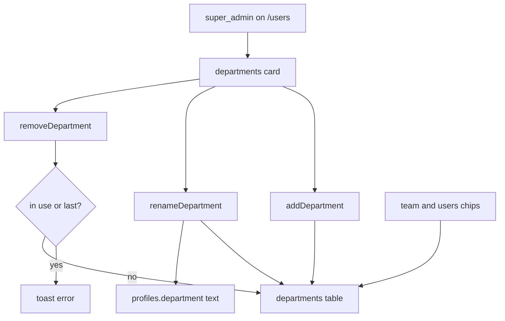

# Department Management Implementation Plan

> **For agentic workers:** REQUIRED SUB-SKILL: Use superpowers:subagent-driven-development (recommended) or superpowers:executing-plans to implement this plan task-by-task. Steps use checkbox (`- [ ]`) syntax for tracking.

**Goal:** Super admin owns a live department list on `/users`; everyone else only picks from it.

**Architecture:** New `departments` table (text names, unique on `lower(name)`). Pure validators in `lib/departments`. Mutate via service-role actions after `requireRole(["super_admin"])`. `profiles.department` stays text. Team and user chips load names ordered by `sort`.

**Tech Stack:** Next.js 15 App Router, Supabase (RLS + service role), Vitest, existing Chip / TextField / Button / Toast.

## Global Constraints

- Super admin adds, renames, and removes departments. Admin and employee never mutate the list.
- Manage UI is a card on `/users`. Admin does not see that card.
- Remove is blocked while any profile still has that department name (`move people first`).
- The last remaining department cannot be removed (`keep at least one`).
- `profiles.department` stays text. No foreign key. Rename rewrites matching profile text to the new name.
- Name: trim, 1–40 chars. Duplicate check is case-insensitive.
- Seed: Engineering, Design, Product, HR, Marketing.
- Select: any authenticated user. Writes: service role only.
- Copy stays lowercase and casual. Cards 12px. No new motion. Follow `docs/DESIGN.md`.
- Do not put department UI on portal config. No drag-to-reorder.



## File map

- Create: `lib/departments/validate.ts`, `lib/departments/validate.test.ts`
- Modify: `lib/rls/policies.ts`, `supabase/tests/rls.test.ts`
- Modify: `lib/profiles/details.ts`, `lib/profiles/details.test.ts`
- Modify: `lib/types.ts`
- Create: `supabase/migrations/0006_departments.sql`
- Modify: `app/(portal)/users/actions.ts`
- Create: `components/users/DepartmentsCard.tsx`
- Modify: `app/(portal)/users/page.tsx`, `components/users/UsersClient.tsx`
- Modify: `app/(portal)/team/page.tsx`, `app/(portal)/team/actions.ts`, `components/team/TeamClient.tsx`

---

### Task 1: Department validators

**Files:**
- Create: `lib/departments/validate.ts`
- Test: `lib/departments/validate.test.ts`

**Interfaces:**
- Produces:
  - `validateDepartmentName(name: string): string | null`
  - `departmentTaken(name: string, existingNames: string[]): boolean`
  - `removeDepartmentError(input: { inUseCount: number; totalCount: number }): string | null`

- [ ] **Step 1: Write the failing test**

```ts
import { describe, expect, it } from "vitest";
import { departmentTaken, removeDepartmentError, validateDepartmentName } from "./validate";

describe("department name", () => {
  it("requires a trimmed name of at most 40 chars", () => {
    expect(validateDepartmentName("  ")).toBe("name required");
    expect(validateDepartmentName("x".repeat(41))).toBe("name too long");
    expect(validateDepartmentName("Sales")).toBeNull();
  });

  it("treats names as taken case-insensitively", () => {
    expect(departmentTaken("engineering", ["Engineering", "Design"])).toBe(true);
    expect(departmentTaken("Sales", ["Engineering"])).toBe(false);
  });

  it("blocks remove when in use or last", () => {
    expect(removeDepartmentError({ inUseCount: 2, totalCount: 5 })).toBe("move people first");
    expect(removeDepartmentError({ inUseCount: 0, totalCount: 1 })).toBe("keep at least one");
    expect(removeDepartmentError({ inUseCount: 0, totalCount: 3 })).toBeNull();
  });
});
```

- [ ] **Step 2: Run test to verify it fails**

Run: `npx vitest run lib/departments/validate.test.ts`

Expected: FAIL with "Cannot find module"

- [ ] **Step 3: Write minimal implementation**

```ts
export function validateDepartmentName(name: string): string | null {
  const trimmed = name.trim();
  if (!trimmed) return "name required";
  if (trimmed.length > 40) return "name too long";
  return null;
}

export function departmentTaken(name: string, existingNames: string[]): boolean {
  const key = name.trim().toLowerCase();
  return existingNames.some((n) => n.trim().toLowerCase() === key);
}

export function removeDepartmentError(input: { inUseCount: number; totalCount: number }): string | null {
  if (input.inUseCount > 0) return "move people first";
  if (input.totalCount <= 1) return "keep at least one";
  return null;
}
```

- [ ] **Step 4: Run test to verify it passes**

Run: `npx vitest run lib/departments/validate.test.ts`

Expected: PASS

- [ ] **Step 5: Commit**

```bash
git add lib/departments/validate.ts lib/departments/validate.test.ts
git commit -m "feat: validate department names and remove rules"
```

---

### Task 2: Super admin can manage departments

**Files:**
- Modify: `lib/rls/policies.ts`
- Test: `supabase/tests/rls.test.ts`

**Interfaces:**
- Produces: `canManageDepartments(role: ProfileRole): boolean` — true only for `super_admin`

- [ ] **Step 1: Write the failing test**

Add to `supabase/tests/rls.test.ts`:

```ts
import { canManageDepartments } from "@/lib/rls/policies";

it("only super_admin manages departments", () => {
  expect(canManageDepartments("employee")).toBe(false);
  expect(canManageDepartments("lead")).toBe(false);
  expect(canManageDepartments("admin")).toBe(false);
  expect(canManageDepartments("super_admin")).toBe(true);
});
```

- [ ] **Step 2: Run test to verify it fails**

Run: `npx vitest run supabase/tests/rls.test.ts`

Expected: FAIL with `canManageDepartments is not a function` or compile error

- [ ] **Step 3: Add the helper**

In `lib/rls/policies.ts`:

```ts
export function canManageDepartments(role: ProfileRole): boolean {
  return isSuperAdmin(role);
}
```

- [ ] **Step 4: Run test to verify it passes**

Run: `npx vitest run supabase/tests/rls.test.ts`

Expected: PASS

- [ ] **Step 5: Commit**

```bash
git add lib/rls/policies.ts supabase/tests/rls.test.ts
git commit -m "feat: gate department management to super_admin"
```

---

### Task 3: Profile details use a live department list

**Files:**
- Modify: `lib/profiles/details.ts`
- Test: `lib/profiles/details.test.ts`
- Modify: `app/(portal)/team/actions.ts`
- Modify: `app/(portal)/users/actions.ts`

**Interfaces:**
- Changes: `validateProfileDetails(input: ProfileDetails, departments: string[]): string | null`
- Removes: `DEPARTMENTS` export
- Keeps: `AVATAR_SWATCHES`, `parseSkills`, `ProfileDetails`

- [ ] **Step 1: Write the failing test**

Replace `lib/profiles/details.test.ts` with:

```ts
import { describe, expect, it } from "vitest";
import { validateProfileDetails } from "./details";

const depts = ["Engineering", "Design"];
const ok = {
  full_name: "Zara Khan",
  designation: "Chaos Coordinator",
  department: "Design",
  skills: ["Figma", "Motion"],
  bio: "makes things move",
  avatar_color: "#7048B6",
};

describe("profile details", () => {
  it("requires name and a known department and swatch", () => {
    expect(validateProfileDetails({ ...ok, full_name: "  " }, depts)).toBe("name required");
    expect(validateProfileDetails({ ...ok, department: "Sales" }, depts)).toBe("invalid department");
    expect(validateProfileDetails({ ...ok, avatar_color: "#000000" }, depts)).toBe("invalid color");
    expect(validateProfileDetails({ ...ok, bio: "x".repeat(281) }, depts)).toBe("bio too long");
    expect(validateProfileDetails({ ...ok, skills: ["x".repeat(41)] }, depts)).toBe("skill too long");
    expect(validateProfileDetails(ok, depts)).toBeNull();
  });
});
```

- [ ] **Step 2: Run test to verify it fails**

Run: `npx vitest run lib/profiles/details.test.ts`

Expected: FAIL — `validateProfileDetails` still takes one argument / still uses hardcoded `DEPARTMENTS`

- [ ] **Step 3: Update validator and call sites**

In `lib/profiles/details.ts` remove `DEPARTMENTS`. Change the department check to:

```ts
export function validateProfileDetails(input: ProfileDetails, departments: string[]): string | null {
  const name = input.full_name.trim();
  if (!name) return "name required";
  if (name.length > 80) return "name too long";
  if (input.designation.trim().length > 80) return "title too long";
  if (!departments.includes(input.department)) return "invalid department";
  const skills = input.skills.map((s) => s.trim()).filter(Boolean);
  if (skills.length > 12) return "too many skills";
  if (skills.some((s) => s.length > 40)) return "skill too long";
  if (input.bio.length > 280) return "bio too long";
  if (!AVATAR_SWATCHES.includes(input.avatar_color as (typeof AVATAR_SWATCHES)[number])) {
    return "invalid color";
  }
  return null;
}
```

`saveProfile` and `updateHumanDetails` / `addHuman` must load names before validate. Until the table exists (Task 4), load via admin/server client and treat a missing table as empty list only if you are combining tasks; otherwise in this task pass a temporary query that will work after Task 4:

```ts
async function departmentNames(): Promise<string[]> {
  const admin = createAdminClient();
  const { data } = await admin.from("departments").select("name").order("sort");
  return (data ?? []).map((d) => d.name);
}
```

Put `departmentNames` in `lib/departments/list.ts` so team and users actions share it:

```ts
import { createAdminClient } from "@/lib/supabase/admin";

export async function departmentNames(): Promise<string[]> {
  const admin = createAdminClient();
  const { data } = await admin.from("departments").select("name").order("sort");
  return (data ?? []).map((row) => row.name as string);
}
```

Team `saveProfile` uses the same helper (service role is fine for a public list). Then `validateProfileDetails(details, await departmentNames())`.

`addHuman` after `validateInvite`: if `departmentTaken` is false against `await departmentNames()` is wrong — require the name to be in the list:

```ts
const names = await departmentNames();
if (!names.includes(input.department)) return { ok: false as const, error: "invalid department" };
```

- [ ] **Step 4: Run tests**

Run: `npx vitest run lib/profiles/details.test.ts`

Expected: PASS

Fix any TypeScript errors from leftover `DEPARTMENTS` imports in clients in Tasks 6–7. If `npx vitest run` fails on TeamClient/UsersClient compile, leave those files for Tasks 6–7 and only keep this task’s files compiling (clients still import `DEPARTMENTS` until those tasks). Vitest may not typecheck unused client files.

- [ ] **Step 5: Commit**

```bash
git add lib/profiles/details.ts lib/profiles/details.test.ts lib/departments/list.ts app/\(portal\)/team/actions.ts app/\(portal\)/users/actions.ts
git commit -m "feat: validate profile department against the live list"
```

---

### Task 4: Departments table

**Files:**
- Create: `supabase/migrations/0006_departments.sql`
- Modify: `lib/types.ts`

**Interfaces:**
- Produces: `Department` type `{ id: string; name: string; sort: number }`
- Table: `public.departments (id uuid pk, name text not null, sort int not null, created_at timestamptz default now())`
- Unique index on `lower(name)`
- RLS: select for `authenticated`, no write policies

- [ ] **Step 1: Add the type**

In `lib/types.ts`:

```ts
export type Department = {
  id: string;
  name: string;
  sort: number;
};
```

- [ ] **Step 2: Write the migration**

```sql
create table public.departments (
  id uuid primary key default gen_random_uuid(),
  name text not null,
  sort int not null,
  created_at timestamptz not null default now()
);

create unique index departments_name_lower on public.departments (lower(name));

insert into public.departments (name, sort) values
  ('Engineering', 1),
  ('Design', 2),
  ('Product', 3),
  ('HR', 4),
  ('Marketing', 5)
on conflict ((lower(name))) do nothing;

alter table public.departments enable row level security;

create policy departments_select on public.departments
  for select to authenticated
  using (true);
```

- [ ] **Step 3: Apply locally if Supabase is running**

Run: `npx supabase db query --linked` is not required. Prefer `npx supabase db push` or paste SQL in the SQL editor. Do not `db reset` unless the user asks (destructive).

- [ ] **Step 4: Commit**

```bash
git add supabase/migrations/0006_departments.sql lib/types.ts
git commit -m "feat: add departments table and seed the current five"
```

---

### Task 5: Super admin department actions

**Files:**
- Modify: `app/(portal)/users/actions.ts`

**Interfaces:**
- Consumes: `validateDepartmentName`, `departmentTaken`, `removeDepartmentError`, `departmentNames`, `canManageDepartments` via `requireRole(["super_admin"])`
- Produces:
  - `addDepartment(name: string): Promise<{ ok: true } | { ok: false; error: string }>`
  - `renameDepartment(id: string, name: string): Promise<{ ok: true } | { ok: false; error: string }>`
  - `removeDepartment(id: string): Promise<{ ok: true } | { ok: false; error: string }>`

- [ ] **Step 1: Add the three actions**

```ts
export async function addDepartment(name: string) {
  await requireRole(["super_admin"]);
  const err = validateDepartmentName(name);
  if (err) return { ok: false as const, error: err };
  const admin = createAdminClient();
  const names = await departmentNames();
  if (departmentTaken(name, names)) return { ok: false as const, error: "name taken" };
  const { data: last } = await admin.from("departments").select("sort").order("sort", { ascending: false }).limit(1).maybeSingle();
  const { error } = await admin.from("departments").insert({
    name: name.trim(),
    sort: (last?.sort ?? 0) + 1,
  });
  if (error) return { ok: false as const, error: error.message };
  revalidatePath("/users");
  revalidatePath("/team");
  return { ok: true as const };
}

export async function renameDepartment(id: string, name: string) {
  await requireRole(["super_admin"]);
  const err = validateDepartmentName(name);
  if (err) return { ok: false as const, error: err };
  const admin = createAdminClient();
  const { data: current } = await admin.from("departments").select("id, name").eq("id", id).maybeSingle();
  if (!current) return { ok: false as const, error: "missing" };
  const others = (await admin.from("departments").select("name").neq("id", id)).data ?? [];
  if (departmentTaken(name, others.map((r) => r.name))) return { ok: false as const, error: "name taken" };
  const next = name.trim();
  const { error } = await admin.from("departments").update({ name: next }).eq("id", id);
  if (error) return { ok: false as const, error: error.message };
  await admin.from("profiles").update({ department: next }).eq("department", current.name);
  revalidatePath("/users");
  revalidatePath("/team");
  return { ok: true as const };
}

export async function removeDepartment(id: string) {
  await requireRole(["super_admin"]);
  const admin = createAdminClient();
  const { data: current } = await admin.from("departments").select("id, name").eq("id", id).maybeSingle();
  if (!current) return { ok: false as const, error: "missing" };
  const { count: inUseCount } = await admin
    .from("profiles")
    .select("id", { count: "exact", head: true })
    .eq("department", current.name);
  const { count: totalCount } = await admin.from("departments").select("id", { count: "exact", head: true });
  const blocked = removeDepartmentError({ inUseCount: inUseCount ?? 0, totalCount: totalCount ?? 0 });
  if (blocked) return { ok: false as const, error: blocked };
  const { error } = await admin.from("departments").delete().eq("id", id);
  if (error) return { ok: false as const, error: error.message };
  revalidatePath("/users");
  revalidatePath("/team");
  return { ok: true as const };
}
```

Import `validateDepartmentName`, `departmentTaken`, `removeDepartmentError` from `@/lib/departments/validate` and `departmentNames` from `@/lib/departments/list`.

- [ ] **Step 2: Typecheck the actions file**

Run: `npx vitest run lib/departments/validate.test.ts lib/profiles/details.test.ts`

Expected: PASS

- [ ] **Step 3: Commit**

```bash
git add app/\(portal\)/users/actions.ts
git commit -m "feat: add rename and remove department actions"
```

---

### Task 6: Departments card on `/users`

**Files:**
- Create: `components/users/DepartmentsCard.tsx`
- Modify: `app/(portal)/users/page.tsx`
- Modify: `components/users/UsersClient.tsx`

**Interfaces:**
- Consumes: `Department`, `canManageDepartments`, `addDepartment`, `renameDepartment`, `removeDepartment`
- `UsersClient` props become `{ rows, me, departments: Department[], canManageDepartments: boolean }`

- [ ] **Step 1: Load departments on the page**

```tsx
import { UsersClient } from "@/components/users/UsersClient";
import { requireRole } from "@/lib/auth";
import { canManageDepartments, USER_MANAGER_ROLES } from "@/lib/rls/policies";
import { createClient } from "@/lib/supabase/server";
import type { Department, Profile } from "@/lib/types";

export default async function UsersPage() {
  const me = await requireRole(USER_MANAGER_ROLES);
  const supabase = await createClient();
  const [{ data }, { data: depts }] = await Promise.all([
    supabase.from("profiles").select("*").order("full_name"),
    supabase.from("departments").select("id, name, sort").order("sort"),
  ]);
  return (
    <UsersClient
      rows={(data ?? []) as Profile[]}
      me={me.id}
      departments={(depts ?? []) as Department[]}
      canManageDepartments={canManageDepartments(me.role)}
    />
  );
}
```

- [ ] **Step 2: Add `DepartmentsCard`**

```tsx
"use client";

import { useState } from "react";
import { addDepartment, removeDepartment, renameDepartment } from "@/app/(portal)/users/actions";
import { Button } from "@/components/ui/Button";
import { TextField } from "@/components/ui/TextField";
import type { Department } from "@/lib/types";

export function DepartmentsCard({
  departments,
  onToast,
}: {
  departments: Department[];
  onToast: (message: string) => void;
}) {
  const [next, setNext] = useState("");
  const [drafts, setDrafts] = useState<Record<string, string>>({});

  return (
    <div className="rounded-ha-lg border border-ha-line bg-ha-surface p-6 shadow-[var(--ha-shadow-card)]">
      <div className="font-[family-name:var(--font-display)] text-[17px] font-bold">departments</div>
      <p className="mb-4 text-xs text-ha-muted">the list everyone picks from. move people before you remove one.</p>
      {departments.map((d) => {
        const value = drafts[d.id] ?? d.name;
        return (
          <div key={d.id} className="mb-3 flex flex-wrap items-end gap-2">
            <TextField
              label="name"
              value={value}
              onChange={(e) => setDrafts({ ...drafts, [d.id]: e.target.value })}
              className="min-w-[160px] flex-1"
            />
            <Button
              variant="ghost"
              onClick={async () => {
                const r = await renameDepartment(d.id, value);
                onToast(r.ok ? "renamed." : r.error ?? "nope");
              }}
            >
              rename
            </Button>
            <Button
              variant="ghost"
              onClick={async () => {
                const r = await removeDepartment(d.id);
                onToast(r.ok ? "removed." : r.error ?? "nope");
              }}
            >
              remove
            </Button>
          </div>
        );
      })}
      <div className="mt-4 flex flex-wrap items-end gap-2 border-t border-ha-line pt-4">
        <TextField
          label="new department"
          value={next}
          onChange={(e) => setNext(e.target.value)}
          className="min-w-[160px] flex-1"
        />
        <Button
          onClick={async () => {
            const r = await addDepartment(next);
            if (!r.ok) {
              onToast(r.error ?? "nope");
              return;
            }
            setNext("");
            onToast("added.");
          }}
        >
          add department
        </Button>
      </div>
    </div>
  );
}
```

- [ ] **Step 3: Wire `UsersClient`**

- Drop `DEPARTMENTS` import. Use `departments.map((d) => d.name)` for chips.
- Props: add `departments` and `canManageDepartments`.
- Default add-human dept: `departments[0]?.name ?? ""`.
- `EditDraft.department` is `string`. Prefill from the live list; if the stored name is missing, use `departments[0]?.name ?? ""`.
- Right column: if `canManageDepartments`, render `<DepartmentsCard departments={departments} onToast={setToast} />` above the add-human form. Wrap the right column in a `div` with `grid gap-5`.
- No new animation classes. Keep `.pageEnter` on the page root only.

- [ ] **Step 4: Manual check**

Sign in as super admin. Add “Sales”, rename it, try to remove Engineering while people have it (toast `move people first`). As admin: no departments card; chips include Sales after revalidate.

- [ ] **Step 5: Commit**

```bash
git add app/\(portal\)/users/page.tsx components/users/UsersClient.tsx components/users/DepartmentsCard.tsx
git commit -m "feat: let super_admin manage departments on the roster"
```

---

### Task 7: Team self-edit uses the live list

**Files:**
- Modify: `app/(portal)/team/page.tsx`
- Modify: `components/team/TeamClient.tsx`

**Interfaces:**
- Consumes: `Department[]` from the page query
- `TeamClient` props: `{ members, me, departments: Department[] }`

- [ ] **Step 1: Load departments on the team page**

```tsx
import { TeamClient } from "@/components/team/TeamClient";
import { requireProfile } from "@/lib/auth";
import { createClient } from "@/lib/supabase/server";
import type { Department, Profile } from "@/lib/types";

export default async function TeamPage() {
  const me = await requireProfile();
  const supabase = await createClient();
  const [{ data }, { data: depts }] = await Promise.all([
    supabase.from("profiles").select("*").eq("active", true).order("full_name"),
    supabase.from("departments").select("id, name, sort").order("sort"),
  ]);
  return (
    <TeamClient
      members={(data ?? []) as Profile[]}
      me={me.id}
      departments={(depts ?? []) as Department[]}
    />
  );
}
```

- [ ] **Step 2: Replace hardcoded chips**

In `TeamClient`, drop `DEPARTMENTS`. Department state is `string`, default `departments[0]?.name ?? ""`. When opening a profile, if `m.department` is in the live names use it, otherwise `departments[0]?.name ?? ""`. Map chips from `departments.map((d) => d.name)`.

- [ ] **Step 3: Run the full unit suite**

Run: `npx vitest run`

Expected: all files PASS

- [ ] **Step 4: Commit**

```bash
git add app/\(portal\)/team/page.tsx components/team/TeamClient.tsx
git commit -m "feat: load team department chips from the live list"
```

---

## Spec coverage

- Super admin CRUD on `/users` card: Tasks 5–6
- Admin hidden card, live chips: Task 6
- Remove in use / last: Tasks 1 and 5
- Rename updates profiles: Task 5
- Table + seed + RLS select-only: Task 4
- `validateProfileDetails` live list: Task 3
- Team chips: Task 7
- `canManageDepartments` super_admin only: Task 2

## Out of scope (do not implement)

- Foreign key from profiles
- Drag-to-reorder
- Admin/employee mutating the list
- Portal config department UI
