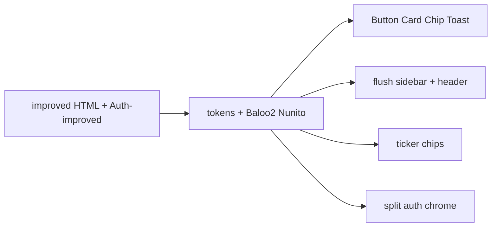

# Design Refinement Visual Implementation Plan

> **For agentic workers:** REQUIRED SUB-SKILL: Use superpowers:subagent-driven-development (recommended) or superpowers:executing-plans to implement this plan task-by-task. Steps use checkbox (`- [ ]`) syntax for tracking.

**Goal:** Make the live portal and auth screens match [Design refinement request/halfAccessible-Portal-improved.dc.html](Design%20refinement%20request/halfAccessible-Portal-improved.dc.html) and [Design refinement request/Auth-improved.dc.html](Design%20refinement%20request/Auth-improved.dc.html) pixel-for-pixel on type, color, radius, and motion.

**Architecture:** Tokens and fonts first so every SCSS module and Tailwind `ha-*` class follows. Then primitives, shell, dashboard ticker chips, and auth chrome. No new tables. TOTP stays. Product features from the HTML (squads, generic polls, signup approval) are out of this plan.

**Tech Stack:** Next.js 15, `next/font/google` (Baloo_2 + Nunito), Tailwind v4 + SCSS modules, Vitest.

## Global Constraints

- Visual source of truth: `Design refinement request/halfAccessible-Portal-improved.dc.html` and `Design refinement request/Auth-improved.dc.html`. Light only.
- Display type: Baloo 2 500/600/700. Body type: Nunito 400/600/700/800. No Space Grotesk. No Inter.
- Canvas `#F7F5FC`. Ink `#39325A`. Accent `#7463D4` / hover `#8577E0`. Soft accent text `#564AA5`. Portal links `#00816F` hover `#7463D4`. Auth links `#7463D4` hover `#8577E0`. Bar teal `#009B8D`.
- Radii: cards `12px`, portal primary buttons `8px`, portal inputs `6px`, nav items `8px`, quick-action cards `10px`, pills `999px`, profile modal `24px`. Auth inputs `10px` / 46px tall. Auth primary buttons `14px`.
- Card chrome: `1px solid rgba(57,50,90,.09)` + `0 1px 3px rgba(57,50,90,.05)`.
- Focus: `3px solid rgba(116,99,212,.45)`, offset 2px, radius 4px in the portal and 6px on auth.
- Keep TOTP. Do not add magic links, squads, drag-drop, or generic polls in this plan.
- Keep mobile bottom nav. Honor `prefers-reduced-motion`.
- Save a copy of this plan to `docs/superpowers/plans/2026-08-14-design-refinement.md` as the first execution step.



## File map

- Create: `docs/superpowers/plans/2026-08-14-design-refinement.md`
- Create: `lib/dashboard/ticker.ts`, `lib/dashboard/ticker.test.ts`
- Modify: [lib/tokens.ts](lib/tokens.ts), [lib/tokens.test.ts](lib/tokens.test.ts), [styles/tokens.scss](styles/tokens.scss), [app/globals.scss](app/globals.scss), [app/layout.tsx](app/layout.tsx)
- Modify: [components/ui/Button/Button.module.scss](components/ui/Button/Button.module.scss), [components/ui/Button/index.tsx](components/ui/Button/index.tsx), [components/ui/TextField/TextField.module.scss](components/ui/TextField/TextField.module.scss), [components/ui/TextField/index.tsx](components/ui/TextField/index.tsx), [components/ui/Toast/Toast.module.scss](components/ui/Toast/Toast.module.scss), [components/ui/Card/Card.module.scss](components/ui/Card/Card.module.scss)
- Modify: [components/layout/Sidebar.module.scss](components/layout/Sidebar.module.scss), [components/layout/AuthShell.module.scss](components/layout/AuthShell.module.scss), [components/layout/AuthShell.tsx](components/layout/AuthShell.tsx)
- Modify: [components/dashboard/Ticker.tsx](components/dashboard/Ticker.tsx), [components/dashboard/Ticker.module.scss](components/dashboard/Ticker.module.scss), [components/dashboard/QuickActions.module.scss](components/dashboard/QuickActions.module.scss), [app/(portal)/page.tsx](app/(portal)/page.tsx)
- Modify: [app/login/LoginFlow.tsx](app/login/LoginFlow.tsx), [app/signup/SignupFlow.tsx](app/signup/SignupFlow.tsx), [app/signup/SignupFlow.module.scss](app/signup/SignupFlow.module.scss)
- Replace: [public/auth-atmosphere.png](public/auth-atmosphere.png) with [Design refinement request/auth-atmosphere.png](Design%20refinement%20request/auth-atmosphere.png) if the files differ

---

### Task 1: Refined tokens

**Files:**
- Modify: `lib/tokens.ts`
- Modify: `lib/tokens.test.ts`
- Modify: `styles/tokens.scss`
- Modify: `app/globals.scss`

**Interfaces:**
- Consumes: none
- Produces: `tokens` with refined hex/radii; CSS vars `--ha-bg`, `--ha-ink`, `--ha-accent` `#7463D4`, `--ha-accent-hover` `#8577E0`, `--ha-soft` `#564AA5`, `--ha-radius-card: 12px`, `--ha-radius-btn: 8px`, `--ha-radius-input: 6px`, `--ha-radius-auth-btn: 14px`, `--ha-radius-auth-input: 10px`

- [ ] **Step 1: Write the failing token tests**

Replace [lib/tokens.test.ts](lib/tokens.test.ts) with:

```ts
import { describe, expect, it } from "vitest";
import { tokens } from "./tokens";

describe("refined canvas tokens", () => {
  it("uses the refined canvas, ink, and lilac", () => {
    expect(tokens.bg).toBe("#F7F5FC");
    expect(tokens.ink).toBe("#39325A");
    expect(tokens.purple).toBe("#7463D4");
    expect(tokens.purpleHover).toBe("#8577E0");
    expect(tokens.soft).toBe("#564AA5");
  });

  it("keeps teal as the portal link and bar accent", () => {
    expect(tokens.teal).toBe("#00816F");
    expect(tokens.tealBar).toBe("#009B8D");
  });

  it("uses the refined radius scale", () => {
    expect(tokens.radiusCard).toBe("12px");
    expect(tokens.radiusBtn).toBe("8px");
    expect(tokens.radiusInput).toBe("6px");
    expect(tokens.radiusAuthBtn).toBe("14px");
    expect(tokens.radiusAuthInput).toBe("10px");
  });
});
```

- [ ] **Step 2: Run test to verify it fails**

Run: `npx vitest run lib/tokens.test.ts`
Expected: FAIL — `tokens.bg` is `#F6F6FA`, `tokens.purple` is `#5B2D8E`, `radiusCard` is `20px`.

- [ ] **Step 3: Write minimal implementation**

`lib/tokens.ts`:

```ts
export const tokens = {
  bg: "#F7F5FC",
  ink: "#39325A",
  muted: "rgba(57,50,90,0.55)",
  surface: "#ffffff",
  line: "rgba(57,50,90,0.08)",
  purple: "#7463D4",
  purpleHover: "#8577E0",
  soft: "#564AA5",
  teal: "#00816F",
  tealBar: "#009B8D",
  card: "#ffffff",
  radiusCard: "12px",
  radiusBtn: "8px",
  radiusInput: "6px",
  radiusAuthBtn: "14px",
  radiusAuthInput: "10px",
  radiusPill: "999px",
  focus: "3px solid rgba(116, 99, 212, 0.45)",
} as const;
```

In `app/globals.scss` `:root`, set matching CSS variables (`--ha-soft`, `--ha-accent-wash: rgba(116,99,212,.07)`, `--ha-shadow-card: 0 1px 3px rgba(57,50,90,.05)`, `--ha-border-card: 1px solid rgba(57,50,90,.09)`, `--ha-radius-card: 12px`, `--ha-radius-btn: 8px`, `--ha-radius-input: 6px`). Keep portal `a` teal / hover lilac. `:focus-visible` border-radius `4px`. Toast/shadow leftovers that still use `rgba(28,28,46)` or `rgba(24,24,27)` switch to `rgba(57,50,90)`.

`styles/tokens.scss`: add `$soft: var(--ha-soft);`.

- [ ] **Step 4: Run test to verify it passes**

Run: `npx vitest run lib/tokens.test.ts`
Expected: PASS

- [ ] **Step 5: Commit**

```bash
git add lib/tokens.ts lib/tokens.test.ts styles/tokens.scss app/globals.scss
git commit -m "feat: adopt refined lilac canvas tokens"
```

---

### Task 2: Baloo 2 + Nunito

**Files:**
- Modify: `app/layout.tsx`
- Modify: `app/globals.scss`

**Interfaces:**
- Consumes: Task 1 CSS vars
- Produces: `--font-baloo`, `--font-nunito` on `<html>`; `--font-display` / `--font-body` mapped to them

- [ ] **Step 1: Swap the root font loaders**

[app/layout.tsx](app/layout.tsx):

```tsx
import { Baloo_2, Nunito } from "next/font/google";

const baloo = Baloo_2({
  subsets: ["latin"],
  weight: ["500", "600", "700"],
  variable: "--font-baloo",
  display: "swap",
});

const nunito = Nunito({
  subsets: ["latin"],
  weight: ["400", "600", "700", "800"],
  variable: "--font-nunito",
  display: "swap",
});
```

Keep variables on `<html>` (the Space Grotesk/Inter bug): `className={`${baloo.variable} ${nunito.variable}`}`.

In `globals.scss`:

```scss
--font-body: var(--font-nunito), system-ui, sans-serif;
--font-display: var(--font-baloo), system-ui, sans-serif;
```

- [ ] **Step 2: Run token tests**

Run: `npx vitest run lib/tokens.test.ts`
Expected: PASS

- [ ] **Step 3: Commit**

```bash
git add app/layout.tsx app/globals.scss
git commit -m "feat: switch type to Baloo 2 and Nunito"
```

---

### Task 3: Primitive radii and toast

**Files:**
- Modify: `components/ui/Button/index.tsx`
- Modify: `components/ui/Button/Button.module.scss`
- Modify: `components/ui/TextField/index.tsx`
- Modify: `components/ui/TextField/TextField.module.scss`
- Modify: `components/ui/Toast/Toast.module.scss`
- Test: `components/ui/Badge/Badge.test.tsx` (lock)

**Interfaces:**
- Consumes: `--ha-radius-btn` 8px, `--ha-radius-auth-btn` 14px, `--ha-radius-auth-input` 10px
- Produces: `Button` `shape?: "default" | "auth"` (default 8px, auth 14px). `TextField` `tone?: "default" | "otp"` (otp = mono 16px, letter-spacing `0.35em`, placeholder `000000`)

- [ ] **Step 1: Run Badge lock**

Run: `npx vitest run components/ui/Badge/Badge.test.tsx`
Expected: PASS

- [ ] **Step 2: Add auth button shape and OTP field tone**

`Button` add optional `shape = "default"`. When `shape="auth"`, apply `.auth` (`border-radius: var(--ha-radius-auth-btn)`; min-height 48px). Default stays `$radius-btn` (8px). Hover still `background: $purple-hover` (`#8577E0`).

`TextField` add optional `tone`. When `tone="otp"`:

```scss
.otp {
  min-height: 46px;
  border-radius: var(--ha-radius-auth-input);
  font-family: ui-monospace, monospace;
  font-size: 16px;
  letter-spacing: 0.35em;
}
```

Default inputs: `$radius-input` 6px. Auth email fields get a class or `className` that sets min-height 46px and radius 10px without OTP tracking.

Toast: `background: #39325A`; `box-shadow: 0 12px 40px rgba(57,50,90,.35)`; `white-space: nowrap`.

- [ ] **Step 3: Re-run Badge lock**

Run: `npx vitest run components/ui/Badge/Badge.test.tsx`
Expected: PASS

- [ ] **Step 4: Commit**

```bash
git add components/ui
git commit -m "feat: tighten primitive radii and toast ink"
```

---

### Task 4: Shell, nav, and dashboard chrome

**Files:**
- Modify: `components/layout/Sidebar.module.scss`
- Modify: `components/dashboard/QuickActions.module.scss`
- Modify: `components/dashboard/StatCards.module.scss`
- Modify: `components/dashboard/Ticker.tsx`
- Modify: `components/dashboard/Ticker.module.scss`
- Create: `lib/dashboard/ticker.ts`
- Create: `lib/dashboard/ticker.test.ts`
- Modify: `app/(portal)/page.tsx`

**Interfaces:**
- Consumes: live voting holiday, approved holidays, open trip poll
- Produces: `buildTickerChips(input: { votingTitle: string | null; countdown: string | null; confirmed: string[]; tripOpen: boolean }): string[]`

- [ ] **Step 1: Write the failing ticker test**

```ts
import { describe, expect, it } from "vitest";
import { buildTickerChips } from "./ticker";

describe("buildTickerChips", () => {
  it("builds live chips and always includes the vibe line", () => {
    expect(
      buildTickerChips({
        votingTitle: "pre–Teacher's Day recharge",
        countdown: "26h",
        confirmed: ["Fri, Sep 4"],
        tripOpen: true,
      }),
    ).toEqual([
      "🍔 burger holiday vote closes in 26h",
      "📅 Fri, Sep 4",
      "✈️ trip poll is open — vote in culture",
      "💜 be nice, it's free",
    ]);
  });

  it("omits empty live chips", () => {
    expect(
      buildTickerChips({
        votingTitle: null,
        countdown: null,
        confirmed: [],
        tripOpen: false,
      }),
    ).toEqual(["💜 be nice, it's free"]);
  });
});
```

- [ ] **Step 2: Run test to verify it fails**

Run: `npx vitest run lib/dashboard/ticker.test.ts`
Expected: FAIL — module not found

- [ ] **Step 3: Implement chips and restyle**

`buildTickerChips` as above. Do not invent fixture copy like "friday demo + samosas".

Replace [components/dashboard/Ticker.tsx](components/dashboard/Ticker.tsx) with a wrap of chips (no marquee):

```tsx
export function Ticker({ items }: { items: string[] }) {
  if (!items.length) return null;
  return (
    <div className={styles.wrap}>
      {items.map((tick) => (
        <div key={tick} className={styles.chip}>{tick}</div>
      ))}
    </div>
  );
}
```

```scss
.wrap { display: flex; flex-wrap: wrap; gap: 10px; margin-bottom: 26px; }
.chip {
  border-radius: 8px;
  background: rgba(116, 99, 212, 0.07);
  border: 1px solid rgba(116, 99, 212, 0.16);
  padding: 9px 16px;
  font-size: 13px;
  font-weight: 600;
  color: var(--ha-soft);
  white-space: nowrap;
}
```

[app/(portal)/page.tsx](app/(portal)/page.tsx): also fetch whether a trip poll is open; pass `buildTickerChips(...)` into `<Ticker items={...} />`.

Sidebar `.link` / `.pill` radius `8px`. Quick actions: card radius `10px`, icon well `8px`. Stat cards inherit 12px from tokens.

- [ ] **Step 4: Run tests**

Run: `npx vitest run lib/dashboard/ticker.test.ts lib/dashboard/stats.test.ts`
Expected: PASS

- [ ] **Step 5: Commit**

```bash
git add components/layout/Sidebar.module.scss components/dashboard lib/dashboard app/\(portal\)/page.tsx
git commit -m "feat: restyle shell and replace ticker with chips"
```

---

### Task 5: Auth screens pixel-perfect

**Files:**
- Modify: `components/layout/AuthShell.module.scss`
- Modify: `app/login/LoginFlow.tsx`
- Modify: `app/signup/SignupFlow.tsx`
- Modify: `app/signup/SignupFlow.module.scss`
- Modify: `app/login/LoginFlow.module.scss`
- Replace: `public/auth-atmosphere.png` if the refinement asset differs

**Interfaces:**
- Consumes: `Button shape="auth"`, `TextField tone="otp"`
- Produces: same TOTP actions; success banner then `router.push("/")`

- [ ] **Step 1: Restyle the shell**

Keep the 50/50 split and `/auth-atmosphere.png`. Remove the dark scrim if the improved HTML has none (it does not — image + manifesto only). Manifesto: Baloo 2, color `#F7F5FC`, letter-spacing `-0.02em`. Brand: Baloo 2 20px `#7463D4`. Scope auth links:

```scss
.page a { color: #7463d4; }
.page a:hover { color: #8577e0; }
```

Auth email inputs: min-height 46px, radius 10px (class on the login/signup forms, not a global TextField change).

- [ ] **Step 2: Match Auth-improved steps**

Login: email `continue` (`shape="auth"`) then OTP `let me in`. On success, set `done` and render:

```tsx
<div className={styles.done}>you're in 🎉 redirecting to the portal…</div>
```

(`background: rgba(16,185,129,.1); border: 1px solid rgba(16,185,129,.3); border-radius: 14px; color: #047857; font-weight: 700`) then `router.push("/")`.

Signup email step copy: sub = `no passwords. no magic links. one QR, thirty seconds.` Button stays `show my QR`. QR step: 120px QR in a dashed lilac card beside helper text; OTP label `first code`; button `lock it in` (`shape="auth"`). Switch link: `log in instead`.

```scss
.qrRow {
  display: flex;
  gap: 16px;
  align-items: center;
  background: #fff;
  border: 1px solid rgba(57, 50, 90, 0.1);
  border-radius: 16px;
  padding: 16px;
}
.qr {
  width: 120px;
  height: 120px;
  flex: none;
  border-radius: 10px;
  border: 1px dashed rgba(116, 99, 212, 0.5);
}
```

Keep the existing TOTP server actions. Do not add a pending-approval gate here.

- [ ] **Step 3: Run unit tests**

Run: `npx vitest run`
Expected: PASS

- [ ] **Step 4: Commit**

```bash
git add components/layout/AuthShell.module.scss app/login app/signup public/auth-atmosphere.png
git commit -m "feat: match refined auth screens"
```

---

### Task 6: Visual verification

**Files:** none unless a screen is off

- [ ] **Step 1: Build and unit suite**

Run: `npx vitest run && npm run build`
Expected:  tests PASS; build succeeds (`Baloo_2` and `Nunito` resolve).

- [ ] **Step 2: Manual pass against the HTML**

With `npm run dev`, compare:
- Sidebar wordmark Baloo 2 `#7463D4`, nav radius 8px
- Home: chip ticker (not marquee), 42px greeting, 12px stat cards, 10px quick actions
- Leaves / burgers / anon / team / culture / announcements / CXO / users inherit 12px cards and 8px primaries
- Login/signup: split, 14px auth buttons, OTP tracking, 120px QR card, success banner
- Dark OS theme still looks like the light refined canvas
- Reduced motion: no wave / float / rain / slideUp

- [ ] **Step 3: Commit only if a fix was needed**

## Follow-up plan (not this work)

Locked product decisions for the next plan:
- Keep TOTP. No magic links.
- Add admin signup-approval: new accounts stay pending until an admin approves on `/users`.
- Squad grouping + drag-drop lead assignment on `/users`, mirrored on `/team`.
- Admin-created generic polls on `/culture` (extend or replace the single trip poll).

## Out of scope

- Prototype "viewing as" role switcher
- Magic-link invites
- Dark theme
- Rewriting RLS except as required by a later feature plan
