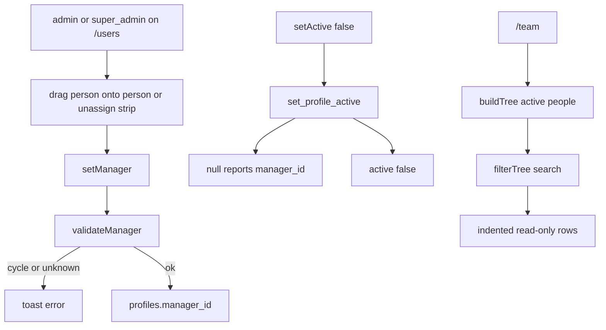

# Employee Hierarchy Implementation Plan

> **For agentic workers:** REQUIRED SUB-SKILL: Use superpowers:subagent-driven-development (recommended) or superpowers:executing-plans to implement this plan task-by-task. Steps use checkbox (`- [ ]`) syntax for tracking.

**Goal:** Admin and super admin build a reporting tree on `/users` by dragging people; everyone sees that indented tree on `/team`.

**Architecture:** Nullable `profiles.manager_id` FK. Pure helpers in `lib/hierarchy` decide cycles, trees, and toast copy. Writes go through service-role actions after `requireRole(USER_MANAGER_ROLES)`. A trigger blocks authenticated self-edits from changing `manager_id`. Deactivate runs `set_profile_active` so clearing reports and flipping `active` is one transaction.

**Tech Stack:** Next.js 15 App Router, Supabase (RLS + service role + RPC), Vitest, existing Avatar / Button / Chip / Toast. HTML5 drag-and-drop plus keyboard pick-up. No new npm packages.

## Global Constraints

- Full tree: anyone can report to anyone. One manager per person. `null` manager means they are a root.
- Multiple roots are allowed. Roots sit at the top of the `/team` tree, mixed together.
- Only `admin` and `super_admin` change reporting, on `/users`. `/team` is read-only for every role.
- Assignment is drag-only. Drop a person onto another person to nest them. Drop on the unassign strip to make them a root. No manager dropdown.
- `/team` replaces the card grid with an indented tree. Search stays. Click opens the same profile modal.
- Deactivate auto-unassigns that person’s reports (`manager_id = null`). Reactivate does not restore those links.
- Moving a person keeps their subtree. Only that person’s `manager_id` changes.
- Cycles and self-manage are rejected. Copy stays lowercase and casual.
- Never show `super_admin` to anyone. They do not appear on `/users`, `/team`, or any other people list or name label. They cannot sit in the tree. The word `super_admin` is not shown in the UI.
- Reuse `canManageUsers`. Do not add a new capability flag.
- Do not open a write RLS policy that lets authenticated users change `manager_id`.
- Existing tokens only. Cards 12px. No new motion. Follow `docs/DESIGN.md`.
- Out of scope: manager dropdown, org-chart boxes, drag on `/team`, leads editing the tree, using hierarchy for leave approval, required single root, restoring reports on reactivate.



## File map

- Create: `lib/hierarchy/validate.ts`, `lib/hierarchy/validate.test.ts`
- Create: `lib/hierarchy/tree.ts`, `lib/hierarchy/tree.test.ts`
- Create: `lib/hierarchy/copy.ts`, `lib/hierarchy/copy.test.ts`
- Create: `lib/profiles/visible.ts`, `lib/profiles/visible.test.ts`
- Modify: `lib/names.ts` (add `firstName`)
- Create: `lib/names.test.ts`
- Modify: `lib/types.ts`
- Modify: `lib/auth.ts` (`getCurrentProfile` select includes `manager_id`)
- Create: `supabase/migrations/0009_employee_hierarchy.sql`
- Modify: `app/(portal)/users/actions.ts`
- Modify: `app/(portal)/users/page.tsx`, `app/(portal)/team/page.tsx`
- Modify: `app/(portal)/leaves/page.tsx`, `app/(portal)/culture/page.tsx`
- Modify: `components/users/UsersClient.tsx`
- Modify: `components/team/TeamClient.tsx`

---

### Task 1: Manager validators and deactivate graph

**Files:**
- Create: `lib/hierarchy/validate.ts`
- Test: `lib/hierarchy/validate.test.ts`

**Interfaces:**
- Produces:
  - `HierarchyPerson = { id: string; manager_id: string | null }`
  - `wouldCycle(personId: string, managerId: string | null, people: HierarchyPerson[]): boolean`
  - `validateManager(personId: string, managerId: string | null, people: HierarchyPerson[]): string | null`
  - `unassignReports<T extends HierarchyPerson>(people: T[], managerId: string): T[]`
  - Super admin ids are never passed in `people`. If they are, `validateManager` returns `unknown person`.

- [ ] **Step 1: Write the failing test**

```ts
import { describe, expect, it } from "vitest";
import { unassignReports, validateManager, wouldCycle } from "./validate";

const people = [
  { id: "a", manager_id: null },
  { id: "b", manager_id: "a" },
  { id: "c", manager_id: "b" },
  { id: "d", manager_id: null },
];

describe("wouldCycle", () => {
  it("treats self as a cycle and walks the proposed manager chain", () => {
    expect(wouldCycle("a", "a", people)).toBe(true);
    expect(wouldCycle("a", "c", people)).toBe(true);
    expect(wouldCycle("b", "c", people)).toBe(true);
    expect(wouldCycle("c", "a", people)).toBe(false);
    expect(wouldCycle("d", "a", people)).toBe(false);
    expect(wouldCycle("a", null, people)).toBe(false);
  });
});

describe("validateManager", () => {
  it("allows unassign and a valid nest", () => {
    expect(validateManager("c", null, people)).toBeNull();
    expect(validateManager("d", "a", people)).toBeNull();
    expect(validateManager("c", "a", people)).toBeNull();
  });

  it("rejects unknown ids and loops", () => {
    expect(validateManager("z", "a", people)).toBe("unknown person");
    expect(validateManager("a", "z", people)).toBe("unknown person");
    expect(validateManager("a", "c", people)).toBe("that would loop the tree");
    expect(validateManager("a", "a", people)).toBe("that would loop the tree");
  });
});

describe("unassignReports", () => {
  it("clears manager_id on direct reports only", () => {
    const next = unassignReports(people, "a");
    expect(next.find((p) => p.id === "b")?.manager_id).toBeNull();
    expect(next.find((p) => p.id === "c")?.manager_id).toBe("b");
    expect(next.find((p) => p.id === "a")?.manager_id).toBeNull();
  });
});
```

- [ ] **Step 2: Run test to verify it fails**

Run: `npx vitest run lib/hierarchy/validate.test.ts`

Expected: FAIL with "Cannot find module"

- [ ] **Step 3: Write minimal implementation**

```ts
export type HierarchyPerson = { id: string; manager_id: string | null };

export function wouldCycle(
  personId: string,
  managerId: string | null,
  people: HierarchyPerson[],
): boolean {
  if (managerId === null) return false;
  if (managerId === personId) return true;
  const byId = new Map(people.map((p) => [p.id, p]));
  const seen = new Set<string>();
  let cursor: string | null = managerId;
  while (cursor) {
    if (cursor === personId) return true;
    if (seen.has(cursor)) return true;
    seen.add(cursor);
    cursor = byId.get(cursor)?.manager_id ?? null;
  }
  return false;
}

export function validateManager(
  personId: string,
  managerId: string | null,
  people: HierarchyPerson[],
): string | null {
  if (!people.some((p) => p.id === personId)) return "unknown person";
  if (managerId !== null && !people.some((p) => p.id === managerId)) return "unknown person";
  if (wouldCycle(personId, managerId, people)) return "that would loop the tree";
  return null;
}

export function unassignReports<T extends HierarchyPerson>(people: T[], managerId: string): T[] {
  return people.map((p) => (p.manager_id === managerId ? { ...p, manager_id: null } : p));
}
```

- [ ] **Step 4: Run test to verify it passes**

Run: `npx vitest run lib/hierarchy/validate.test.ts`

Expected: PASS

- [ ] **Step 5: Commit**

```bash
git add lib/hierarchy/validate.ts lib/hierarchy/validate.test.ts
git commit -m "feat: validate reporting cycles and unassign reports"
```

---

### Task 2: Tree builder and search filter

**Files:**
- Create: `lib/hierarchy/tree.ts`
- Test: `lib/hierarchy/tree.test.ts`

**Interfaces:**
- Consumes: `HierarchyPerson` from `./validate`; `matchesMember` from `@/lib/team/search`
- Produces:
  - `TreeNode<T> = { person: T; children: TreeNode<T>[] }`
  - `buildTree<T extends HierarchyPerson & { full_name: string }>(people: T[]): TreeNode<T>[]`
  - `filterTree<T extends HierarchyPerson & SearchableMember>(nodes: TreeNode<T>[], query: string): TreeNode<T>[]`

- [ ] **Step 1: Write the failing test**

```ts
import { describe, expect, it } from "vitest";
import { buildTree, filterTree } from "./tree";

const zara = {
  id: "z",
  full_name: "Zara Khan",
  manager_id: null,
  designation: "Eng",
  department: "Engineering",
  skills: ["ts"],
};
const priya = {
  id: "p",
  full_name: "Priya Nair",
  manager_id: null,
  designation: "Design Lead",
  department: "Design",
  skills: ["Figma"],
};
const ananya = {
  id: "a",
  full_name: "Ananya Rao",
  manager_id: "p",
  designation: "PM",
  department: "Product",
  skills: ["Roadmaps"],
};
const ghost = {
  id: "g",
  full_name: "Ghost Report",
  manager_id: "missing",
  designation: "Ops",
  department: "HR",
  skills: [],
};

describe("buildTree", () => {
  it("makes multiple roots, nests children, and sorts by name", () => {
    const tree = buildTree([zara, ananya, priya]);
    expect(tree.map((n) => n.person.id)).toEqual(["p", "z"]);
    expect(tree[0].children.map((n) => n.person.id)).toEqual(["a"]);
  });

  it("treats a missing manager as a root", () => {
    const tree = buildTree([ghost, zara]);
    expect(tree.map((n) => n.person.id)).toEqual(["g", "z"]);
  });
});

describe("filterTree", () => {
  const tree = buildTree([zara, ananya, priya]);

  it("returns the full tree for an empty query", () => {
    expect(filterTree(tree, "  ").map((n) => n.person.id)).toEqual(["p", "z"]);
  });

  it("keeps ancestors of a match and drops non-matching branches", () => {
    const filtered = filterTree(tree, "ananya");
    expect(filtered.map((n) => n.person.id)).toEqual(["p"]);
    expect(filtered[0].children.map((n) => n.person.id)).toEqual(["a"]);
  });

  it("returns an empty list when nothing matches", () => {
    expect(filterTree(tree, "nope")).toEqual([]);
  });
});
```

- [ ] **Step 2: Run test to verify it fails**

Run: `npx vitest run lib/hierarchy/tree.test.ts`

Expected: FAIL with "Cannot find module"

- [ ] **Step 3: Write minimal implementation**

```ts
import { matchesMember, type SearchableMember } from "@/lib/team/search";
import type { HierarchyPerson } from "./validate";

export type TreeNode<T> = { person: T; children: TreeNode<T>[] };

export function buildTree<T extends HierarchyPerson & { full_name: string }>(people: T[]): TreeNode<T>[] {
  const ids = new Set(people.map((p) => p.id));
  const kids = new Map<string, T[]>();
  const roots: T[] = [];
  for (const person of people) {
    if (person.manager_id && ids.has(person.manager_id)) {
      const list = kids.get(person.manager_id) ?? [];
      list.push(person);
      kids.set(person.manager_id, list);
    } else {
      roots.push(person);
    }
  }
  const byName = (a: T, b: T) => a.full_name.localeCompare(b.full_name);
  function node(person: T): TreeNode<T> {
    return {
      person,
      children: (kids.get(person.id) ?? []).slice().sort(byName).map(node),
    };
  }
  return roots.slice().sort(byName).map(node);
}

export function filterTree<T extends HierarchyPerson & SearchableMember>(
  nodes: TreeNode<T>[],
  query: string,
): TreeNode<T>[] {
  if (!query.trim()) return nodes;
  const out: TreeNode<T>[] = [];
  for (const n of nodes) {
    const children = filterTree(n.children, query);
    if (children.length > 0 || matchesMember(n.person, query)) {
      out.push({ person: n.person, children });
    }
  }
  return out;
}
```

- [ ] **Step 4: Run test to verify it passes**

Run: `npx vitest run lib/hierarchy/tree.test.ts`

Expected: PASS

- [ ] **Step 5: Commit**

```bash
git add lib/hierarchy/tree.ts lib/hierarchy/tree.test.ts
git commit -m "feat: build and filter the reporting tree"
```

---

### Task 3: First name and toast copy

**Files:**
- Modify: `lib/names.ts`
- Create: `lib/names.test.ts`
- Create: `lib/hierarchy/copy.ts`
- Test: `lib/hierarchy/copy.test.ts`

**Interfaces:**
- Consumes: `firstName` from `@/lib/names`
- Produces:
  - `firstName(name: string): string` — first whitespace token, or `""`
  - `managerToast(personName: string, managerName: string | null): string`

- [ ] **Step 1: Write the failing tests**

`lib/names.test.ts`:

```ts
import { describe, expect, it } from "vitest";
import { firstName, initials } from "./names";

describe("firstName", () => {
  it("returns the first token", () => {
    expect(firstName("Zara Khan")).toBe("Zara");
    expect(firstName("  Priya  Nair ")).toBe("Priya");
    expect(firstName("   ")).toBe("");
  });
});

describe("initials", () => {
  it("still works", () => {
    expect(initials("Zara Khan")).toBe("ZK");
  });
});
```

`lib/hierarchy/copy.test.ts`:

```ts
import { describe, expect, it } from "vitest";
import { managerToast } from "./copy";

describe("managerToast", () => {
  it("nests and unassigns with first names", () => {
    expect(managerToast("Zara Khan", "Priya Nair")).toBe("Zara now reports to Priya");
    expect(managerToast("Zara Khan", null)).toBe("Zara is a root");
  });
});
```

- [ ] **Step 2: Run tests to verify they fail**

Run: `npx vitest run lib/names.test.ts lib/hierarchy/copy.test.ts`

Expected: FAIL (`firstName` / `managerToast` missing)

- [ ] **Step 3: Write minimal implementation**

In `lib/names.ts` add:

```ts
export function firstName(name: string): string {
  return name.trim().split(/\s+/).filter(Boolean)[0] ?? "";
}
```

`lib/hierarchy/copy.ts`:

```ts
import { firstName } from "@/lib/names";

export function managerToast(personName: string, managerName: string | null): string {
  const person = firstName(personName);
  if (!managerName) return `${person} is a root`;
  return `${person} now reports to ${firstName(managerName)}`;
}
```

- [ ] **Step 4: Run tests to verify they pass**

Run: `npx vitest run lib/names.test.ts lib/hierarchy/copy.test.ts`

Expected: PASS

- [ ] **Step 5: Commit**

```bash
git add lib/names.ts lib/names.test.ts lib/hierarchy/copy.ts lib/hierarchy/copy.test.ts
git commit -m "feat: first-name toast copy for reporting changes"
```

---

### Task 3b: Super admin is never listed

**Files:**
- Create: `lib/profiles/visible.ts`
- Test: `lib/profiles/visible.test.ts`
- Modify: `app/(portal)/users/page.tsx`
- Modify: `app/(portal)/team/page.tsx`
- Modify: `app/(portal)/leaves/page.tsx`
- Modify: `app/(portal)/culture/page.tsx`

**Interfaces:**
- Produces: `isVisiblePerson(role: ProfileRole): boolean` — false only for `super_admin`

- [ ] **Step 1: Write the failing test**

```ts
import { describe, expect, it } from "vitest";
import { isVisiblePerson } from "./visible";

describe("isVisiblePerson", () => {
  it("hides only super_admin", () => {
    expect(isVisiblePerson("super_admin")).toBe(false);
    expect(isVisiblePerson("admin")).toBe(true);
    expect(isVisiblePerson("lead")).toBe(true);
    expect(isVisiblePerson("employee")).toBe(true);
  });
});
```

- [ ] **Step 2: Run test to verify it fails**

Run: `npx vitest run lib/profiles/visible.test.ts`

Expected: FAIL with "Cannot find module"

- [ ] **Step 3: Write minimal implementation**

```ts
import type { ProfileRole } from "@/lib/types";

export function isVisiblePerson(role: ProfileRole): boolean {
  return role !== "super_admin";
}
```

- [ ] **Step 4: Filter every people query**

`app/(portal)/users/page.tsx` — change the profiles select to:

```ts
supabase.from("profiles").select("*").neq("role", "super_admin").order("full_name"),
```

`app/(portal)/team/page.tsx`:

```ts
supabase.from("profiles").select("*").eq("active", true).neq("role", "super_admin").order("full_name"),
```

`app/(portal)/leaves/page.tsx` — add `.neq("role", "super_admin")` to the names select.

`app/(portal)/culture/page.tsx` — add `.neq("role", "super_admin")` to the names select.

Do not print the string `super_admin` in any of these UIs.

- [ ] **Step 5: Run test to verify it passes**

Run: `npx vitest run lib/profiles/visible.test.ts`

Expected: PASS

- [ ] **Step 6: Commit**

```bash
git add lib/profiles/visible.ts lib/profiles/visible.test.ts app/\(portal\)/users/page.tsx app/\(portal\)/team/page.tsx app/\(portal\)/leaves/page.tsx app/\(portal\)/culture/page.tsx
git commit -m "feat: hide super admin from every people list"
```

---

### Task 4: Schema, type, and self-edit guard

**Files:**
- Modify: `lib/types.ts`
- Modify: `lib/auth.ts`
- Create: `supabase/migrations/0009_employee_hierarchy.sql`

**Interfaces:**
- Consumes: none
- Produces: `Profile.manager_id: string | null`; column + trigger + `set_profile_active(p_id uuid, p_active boolean)` granted to `service_role` only

- [ ] **Step 1: Add `manager_id` to the Profile type**

In `lib/types.ts`, add `manager_id: string | null;` after `id`.

- [ ] **Step 2: Include it on the session profile select**

In `lib/auth.ts`, change the `select` string to:

```ts
"id, manager_id, full_name, designation, department, skills, bio, avatar_color, role, active, joined_at, totp_verified_at, ann_seen_at",
```

- [ ] **Step 3: Write the migration**

`supabase/migrations/0009_employee_hierarchy.sql`:

```sql
alter table public.profiles
  add column if not exists manager_id uuid references public.profiles (id) on delete set null;

create or replace function public.guard_manager_id()
returns trigger
language plpgsql
as $$
begin
  if old.manager_id is not distinct from new.manager_id then
    return new;
  end if;
  if auth.uid() is not null then
    raise exception 'cannot change manager';
  end if;
  return new;
end;
$$;

drop trigger if exists profiles_guard_manager_id on public.profiles;
create trigger profiles_guard_manager_id
  before update on public.profiles
  for each row
  execute function public.guard_manager_id();

create or replace function public.set_profile_active(p_id uuid, p_active boolean)
returns void
language plpgsql
security definer
set search_path = public
as $$
begin
  if not p_active then
    update public.profiles
    set manager_id = null
    where manager_id = p_id;
  end if;

  update public.profiles
  set active = p_active
  where id = p_id;

  if not found then
    raise exception 'missing';
  end if;
end;
$$;

revoke all on function public.set_profile_active(uuid, boolean) from public, anon, authenticated;
grant execute on function public.set_profile_active(uuid, boolean) to service_role;
```

The trigger fires for authenticated clients (self-edit and admin RLS). Service-role actions have `auth.uid()` null, so `setManager` still works. Do not add a write policy on `manager_id`.

- [ ] **Step 4: Apply locally if Docker is up**

Run: `npx supabase db reset` only if the local stack is already used in this repo’s workflow. If Docker is not running, skip; Vercel/hosted apply happens on deploy. Do not invent a fake migrate.

- [ ] **Step 5: Commit**

```bash
git add lib/types.ts lib/auth.ts supabase/migrations/0009_employee_hierarchy.sql
git commit -m "feat: add profiles.manager_id and deactivate RPC"
```

---

### Task 5: setManager and transactional deactivate

**Files:**
- Modify: `app/(portal)/users/actions.ts`

**Interfaces:**
- Consumes: `validateManager` from `@/lib/hierarchy/validate`; `USER_MANAGER_ROLES`; `createAdminClient`
- Produces:
  - `setManager(personId: string, managerId: string | null): Promise<{ ok: true } | { ok: false, error: string }>`
  - `setActive` calls `set_profile_active` before auth metadata; revalidates `/users` and `/team`

- [ ] **Step 1: Add `setManager`**

At the bottom of the existing imports in `app/(portal)/users/actions.ts` add:

```ts
import { validateManager } from "@/lib/hierarchy/validate";
import { isVisiblePerson } from "@/lib/profiles/visible";
```

Add this function after `setRole`:

```ts
export async function setManager(personId: string, managerId: string | null) {
  await requireRole(USER_MANAGER_ROLES);
  const admin = createAdminClient();
  const { data } = await admin.from("profiles").select("id, manager_id, role");
  const people = (data ?? []).filter((p) => isVisiblePerson(p.role));
  const err = validateManager(personId, managerId, people);
  if (err) return { ok: false as const, error: err };
  const current = people.find((p) => p.id === personId);
  if ((current?.manager_id ?? null) === managerId) return { ok: true as const };
  const { error } = await admin.from("profiles").update({ manager_id: managerId }).eq("id", personId);
  if (error) return { ok: false as const, error: error.message };
  revalidatePath("/users");
  revalidatePath("/team");
  return { ok: true as const };
}
```

- [ ] **Step 2: Change `setActive` to the RPC**

Replace `setActive` with:

```ts
export async function setActive(userId: string, active: boolean) {
  await requireRole(USER_MANAGER_ROLES);
  const admin = createAdminClient();
  const { error } = await admin.rpc("set_profile_active", { p_id: userId, p_active: active });
  if (error) return { ok: false as const, error: error.message };
  await admin.auth.admin.updateUserById(userId, {
    app_metadata: { deactivated: !active },
  });
  revalidatePath("/users");
  revalidatePath("/team");
  return { ok: true as const };
}
```

If the RPC fails, do not touch auth metadata and do not flip `active` in JS. Reactivate does not write `manager_id`.

- [ ] **Step 3: Typecheck**

Run: `npx tsc --noEmit`

Expected: PASS (or only pre-existing errors unrelated to these files)

- [ ] **Step 4: Commit**

```bash
git add app/\(portal\)/users/actions.ts
git commit -m "feat: set manager and clear reports on deactivate"
```

---

### Task 6: Drag-and-drop roster on `/users`

**Files:**
- Modify: `components/users/UsersClient.tsx`

**Interfaces:**
- Consumes: `setManager` from `@/app/(portal)/users/actions`; `validateManager`; `managerToast`
- Produces: unassign strip + row drag/drop + keyboard pick-up. No manager dropdown.

- [ ] **Step 1: Wire imports and pick-up state**

Add to the existing imports:

```ts
import { addHuman, resetAuthenticator, setActive, setManager, setRole, updateHumanDetails } from "@/app/(portal)/users/actions";
import { managerToast } from "@/lib/hierarchy/copy";
import { validateManager } from "@/lib/hierarchy/validate";
```

Inside `UsersClient`, after the draft state:

```ts
const [dragId, setDragId] = useState<string | null>(null);
const [overId, setOverId] = useState<string | null>(null);
```

Add these helpers inside the component, after `openDetails`:

```ts
  function personById(id: string) {
    return rows.find((r) => r.id === id);
  }

  async function dropOn(targetId: string | null) {
    if (!dragId) return;
    const err = validateManager(
      dragId,
      targetId,
      rows.map((r) => ({ id: r.id, manager_id: r.manager_id })),
    );
    if (err) {
      setToast(err);
      setDragId(null);
      setOverId(null);
      return;
    }
    const r = await setManager(dragId, targetId);
    const person = personById(dragId);
    const manager = targetId ? personById(targetId) : null;
    setDragId(null);
    setOverId(null);
    if (!r.ok) {
      setToast(r.error ?? "nope");
      return;
    }
    if (person) setToast(managerToast(person.full_name, manager?.full_name ?? null));
  }

  function onRowKeyDown(e: React.KeyboardEvent, id: string | null) {
    if (e.key === "Escape") {
      setDragId(null);
      setOverId(null);
      return;
    }
    if (e.key !== " " && e.key !== "Enter") return;
    e.preventDefault();
    if (!dragId) {
      if (id) setDragId(id);
      return;
    }
    void dropOn(id);
  }
```

- [ ] **Step 2: Add the unassign strip and make rows droppable**

Change the roster blurb to:

```tsx
        <p className="mb-3.5 text-xs text-ha-muted">
          roles, access, authenticators. drag someone onto a person to nest them. deactivating keeps their history - we
          don&apos;t erase people.
        </p>
        <div
          role="button"
          tabIndex={0}
          aria-label="drop here to make them a root"
          onDragOver={(e) => {
            e.preventDefault();
            setOverId("unassign");
          }}
          onDrop={(e) => {
            e.preventDefault();
            void dropOn(null);
          }}
          onKeyDown={(e) => onRowKeyDown(e, null)}
          className="mb-3 rounded-[10px] border border-dashed px-3 py-2 text-[12px] font-semibold text-ha-muted"
          style={{
            borderColor: overId === "unassign" && dragId ? "#7463D4" : "rgba(57,50,90,0.12)",
            background: overId === "unassign" && dragId ? "rgba(116,99,212,0.05)" : "transparent",
          }}
        >
          drop here to make them a root
        </div>
```

Wrap each roster row (`rows.map`) outer `div` like this. Keep the inner role chips / details / deactivate markup unchanged:

```tsx
          <div
            key={u.id}
            draggable
            onDragStart={(e) => {
              e.dataTransfer.effectAllowed = "move";
              setDragId(u.id);
            }}
            onDragEnd={() => {
              setDragId(null);
              setOverId(null);
            }}
            onDragOver={(e) => {
              e.preventDefault();
              setOverId(u.id);
            }}
            onDrop={(e) => {
              e.preventDefault();
              void dropOn(u.id);
            }}
            onKeyDown={(e) => onRowKeyDown(e, u.id)}
            tabIndex={0}
            aria-grabbed={dragId === u.id}
            className="border-b border-ha-line"
            style={{
              opacity: dragId === u.id ? 0.35 : u.active ? 1 : 0.5,
              outline: overId === u.id && dragId && dragId !== u.id ? "2px solid #7463D4" : undefined,
              background: overId === u.id && dragId && dragId !== u.id ? "rgba(116,99,212,0.05)" : undefined,
              cursor: "grab",
            }}
          >
```

Do not add a manager `<select>`. Filter `rows` with `isVisiblePerson` before render so a leaked super_admin row never appears. Delete the `u.role === "super_admin"` badge branch — that label must not ship. Every remaining row uses the normal role chips / details / deactivate controls.

- [ ] **Step 3: Handle deactivate toast errors**

Change the deactivate button to:

```tsx
                  <Button
                    variant="ghost"
                    onClick={async () => {
                      const r = await setActive(u.id, !u.active);
                      if (!r.ok) setToast(r.error ?? "nope");
                    }}
                  >
                    {u.active ? "deactivate" : "reactivate"}
                  </Button>
```

- [ ] **Step 4: Typecheck**

Run: `npx tsc --noEmit`

Expected: PASS for these files

- [ ] **Step 5: Commit**

```bash
git add components/users/UsersClient.tsx
git commit -m "feat: drag people into the reporting tree on users"
```

---

### Task 7: Indented tree on `/team`

**Files:**
- Modify: `components/team/TeamClient.tsx`

**Interfaces:**
- Consumes: `buildTree`, `filterTree` from `@/lib/hierarchy/tree`
- Produces: searchable indented tree; same profile modal; no drag

- [ ] **Step 1: Replace the card grid with a tree**

Add imports:

```ts
import { buildTree, filterTree, type TreeNode } from "@/lib/hierarchy/tree";
```

Replace `const list = useMemo(...)` with:

```ts
  const tree = useMemo(() => filterTree(buildTree(members), q), [members, q]);
```

Replace the `{list.length === 0 ? (` block through the grid’s closing `)}` with:

```tsx
      {members.length === 0 ? (
        <EmptyState
          icon={<MagnifyingGlass size={28} />}
          title="nobody here yet"
          body="the roster is empty. ask an admin to add a human."
        />
      ) : tree.length === 0 ? (
        <EmptyState
          icon={<MagnifyingGlass size={28} />}
          title="nobody matches that vibe"
          body='try a name, role, dept, or skill - like "figma" or "engineering"'
        />
      ) : (
        <div className="rounded-ha-lg border border-ha-line bg-ha-surface p-2 shadow-[var(--ha-shadow-card)]">
          <TreeRows nodes={tree} depth={0} me={me} onOpen={openProfile} />
        </div>
      )}
```

Keep the profile modal JSX exactly as it is. Do not add drag handlers. Do not edit `manager_id` in the modal.

Add this component in the same file, above `TeamClient`:

```tsx
function TreeRows({
  nodes,
  depth,
  me,
  onOpen,
}: {
  nodes: TreeNode<Profile>[];
  depth: number;
  me: string;
  onOpen: (m: Profile) => void;
}) {
  return (
    <>
      {nodes.map((n) => (
        <div key={n.person.id}>
          <button
            type="button"
            onClick={() => onOpen(n.person)}
            className="flex w-full items-center gap-3 rounded-[8px] px-3 py-2.5 text-left hover:bg-ha-accent-wash"
            style={{ paddingLeft: 12 + depth * 22 }}
          >
            {depth > 0 ? (
              <span
                aria-hidden
                className="mr-1 h-6 w-0.5 shrink-0 bg-[rgba(116,99,212,0.25)]"
              />
            ) : null}
            <Avatar initials={initials(n.person.full_name)} color={n.person.avatar_color} />
            <span className="min-w-0">
              <span className="block font-[family-name:var(--font-display)] text-[15.5px] font-bold">
                {n.person.full_name} {n.person.id === me ? "(you)" : ""}
              </span>
              <span className="block text-[12.5px] font-semibold" style={{ color: n.person.avatar_color }}>
                {n.person.designation} · {n.person.department}
              </span>
            </span>
          </button>
          {n.children.length > 0 ? (
            <TreeRows nodes={n.children} depth={depth + 1} me={me} onOpen={onOpen} />
          ) : null}
        </div>
      ))}
    </>
  );
}
```

Empty roster copy: the current file only has the search empty state. Use that exact search copy for no hits. For a truly empty `members` array, the title `nobody here yet` is allowed because the spec says “existing empty state” for the empty roster and the search string is reserved for no hits.

- [ ] **Step 2: Typecheck and unit tests**

Run: `npx vitest run lib/hierarchy lib/names.test.ts && npx tsc --noEmit`

Expected: all new tests PASS; no new type errors

- [ ] **Step 3: Manual check**

With `npm run dev`, as admin on `/users`: drag A onto B, confirm toast and `/team` nest. Drag A onto the strip, confirm they are a root. Drag a manager onto their report, confirm `that would loop the tree`. Deactivate a manager, confirm their reports become roots on `/team` and stay roots after reactivate. As an employee, `/team` is read-only and `/users` is blocked. Confirm the super_admin account never appears on `/users` or `/team`, including when the signed-in user is super_admin.

- [ ] **Step 4: Commit**

```bash
git add components/team/TeamClient.tsx
git commit -m "feat: show the reporting tree on team"
```

---

## Self-review

**Spec coverage**

| Spec item | Task |
| --- | --- |
| `manager_id` FK, Profile type | 4 |
| `wouldCycle` / `validateManager` / unknown id | 1 |
| `unassignReports` / deactivate clears reports | 1 + 4 RPC + 5 |
| Reactivate does not restore | 5 (`set_profile_active` only nulls when `p_active` is false) |
| `buildTree` / `filterTree` / missing manager is root | 2 |
| `setManager` gated to USER_MANAGER_ROLES | 5 |
| Self-edit cannot change `manager_id` | 4 trigger (`auth.uid()` not null) |
| Drag + unassign strip + cycle toast + first-name toasts | 3 + 6 |
| Keyboard pick-up, no dropdown | 6 |
| `/team` indented tree, search keeps ancestors, modal unchanged | 7 |
| Super admin never listed or labeled | 3b + 5 filter + 6 |
| No new capability flag | reuse `canManageUsers` / `USER_MANAGER_ROLES` |

**Placeholders:** none.

**Types:** `HierarchyPerson`, `TreeNode`, `setManager(personId, managerId: string | null)`, `set_profile_active(p_id, p_active)` are named the same in every task.
