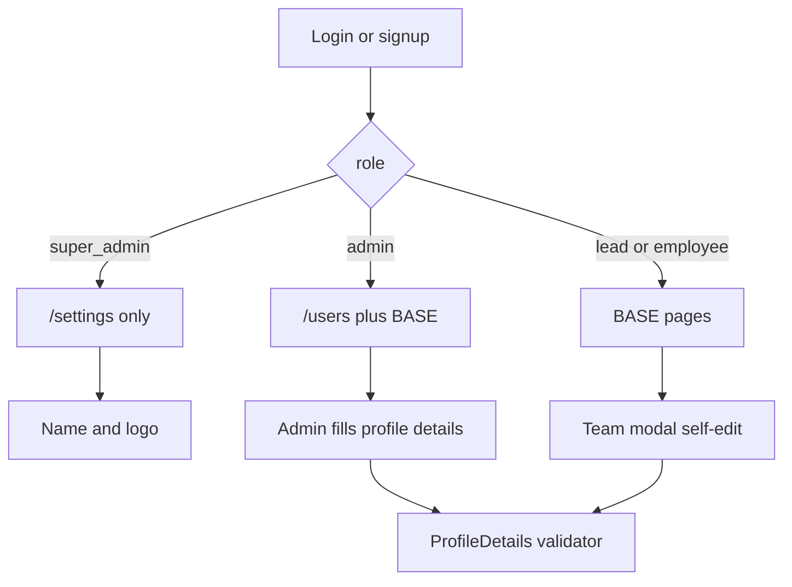

# Super Admin Lock, Profile Edits, and Design Rules

> **For agentic workers:** REQUIRED SUB-SKILL: Use superpowers:subagent-driven-development (recommended) or superpowers:executing-plans to implement this plan task-by-task. Steps use checkbox (`- [ ]`) syntax for tracking.

**Goal:** Super admin sees only `/settings`. Admins fill roster details on `/users`. Anyone can edit their own name, designation, department, skills, bio, and avatar color. New UI follows one written design and motion spec.

**Architecture:** Add `canVisitPath` / `afterAuthPath` so nav, layout, `/anon`, and post-login redirects share one access table. Share one `ProfileDetails` validator for admin updates and self-edit. Persist design and motion as `docs/DESIGN.md` plus `lib/motion.ts` tests so values cannot drift.

**Tech Stack:** Next.js 15 App Router, Supabase RLS, Vitest, existing TextField/TextArea/Chip/Toast, Motion + CSS keyframes already in [app/globals.scss](app/globals.scss).

## Global Constraints

- Super admin nav is portal config only. Other portal URLs including `/`, `/users`, and `/anon` redirect to `/settings`.
- `canManageUsers` is `admin` only. `canManageSettings` stays `super_admin` only. Super admin does not inherit admin roster or leave/burger powers.
- Editable profile fields (admin on others, self on own): `full_name`, `designation`, `department`, `skills`, `bio`, `avatar_color`.
- Not editable here: `role`, `active`, `email`, authenticator. Admin still changes role/active/reset on `/users`. Nobody assigns `super_admin`.
- Self-edit cannot change `role` (existing RLS `profiles_update_self` already requires `role = current_profile_role()`).
- Departments stay the existing chip list: Engineering, Design, Product, HR, Marketing.
- Avatar colors stay the existing swatches: `#7048B6`, `#0E9488`, `#D97706`, `#DB2777`, `#0284C7`, `#65A30D`.
- Copy stays lowercase / casual. Light theme only. Honor `prefers-reduced-motion`.
- Do not change `TOTP_ISSUER`.
- Save this plan to `docs/superpowers/plans/2026-08-14-roles-profiles-design.md` as the first execution step.



## File map

- Create: `docs/superpowers/plans/2026-08-14-roles-profiles-design.md`
- Create: `docs/DESIGN.md`
- Create: `lib/motion.ts`, `lib/motion.test.ts`
- Create: `lib/layout/access.ts`, `lib/layout/access.test.ts`
- Create: `lib/profiles/details.ts`, `lib/profiles/details.test.ts`
- Modify: [lib/tokens.ts](lib/tokens.ts), [lib/tokens.test.ts](lib/tokens.test.ts)
- Modify: [lib/rls/policies.ts](lib/rls/policies.ts), [supabase/tests/rls.test.ts](supabase/tests/rls.test.ts)
- Modify: [lib/layout/navItems.ts](lib/layout/navItems.ts), [components/layout/navItems.test.ts](components/layout/navItems.test.ts)
- Modify: [app/(portal)/layout.tsx](app/(portal)/layout.tsx), [app/anon/page.tsx](app/anon/page.tsx)
- Modify: [app/login/LoginFlow.tsx](app/login/LoginFlow.tsx), [app/signup/SignupFlow.tsx](app/signup/SignupFlow.tsx)
- Modify: [components/layout/MobileNav.tsx](components/layout/MobileNav.tsx)
- Modify: [app/(portal)/team/actions.ts](app/(portal)/team/actions.ts), [components/team/TeamClient.tsx](components/team/TeamClient.tsx)
- Modify: [app/(portal)/users/actions.ts](app/(portal)/users/actions.ts), [components/users/UsersClient.tsx](components/users/UsersClient.tsx)
- Create: `supabase/migrations/0005_super_admin_settings_only.sql`

---

### Task 1: Design and motion rules

**Files:**
- Create: `docs/superpowers/plans/2026-08-14-roles-profiles-design.md`
- Create: `docs/DESIGN.md`
- Create: `lib/motion.ts`
- Test: `lib/motion.test.ts`
- Modify: [lib/tokens.ts](lib/tokens.ts), [lib/tokens.test.ts](lib/tokens.test.ts)

**Interfaces:**
- Produces: `motion` object below. Later UI tasks must use these values, not new easings or durations.

Write `docs/DESIGN.md` with these rules verbatim (this is the project spec, not a sketch):

**Color (light only)**
- Canvas `#F7F5FC`. Ink `#39325A`. Muted `rgba(57,50,90,0.55)`.
- Surface `#FFFFFF`. Line `rgba(57,50,90,0.08)`. Card border `1px solid rgba(57,50,90,0.09)`. Card shadow `0 1px 3px rgba(57,50,90,0.05)`.
- Accent `#7463D4`. Hover `#8577E0`. Soft `#564AA5`. Wash `rgba(116,99,212,0.07)`.
- Portal links `#00816F` hover `#7463D4`. Auth links `#7463D4` hover `#8577E0`. Bar teal `#009B8D`. Danger `#B91C1C`.
- No dark mode. No extra brand colors except the six avatar swatches.

**Type**
- Display: Baloo 2 500/600/700 via `--font-display`. Body: Nunito 400/600/700/800 via `--font-body`.
- Page title 26px / 700. Card title 16–17px / 700. Body 13.5–14px. Meta 11–12.5px. Labels 11.5px uppercase tracking-wider.
- Copy is lowercase and casual. No sentence-case corporate headings.

**Shape and focus**
- Cards 12px. Portal buttons 8px. Portal inputs 6px. Auth buttons 14px. Auth inputs 10px. Pills 999px. Profile modal 24px.
- Focus: `3px solid rgba(116,99,212,0.45)`, offset 2px, radius 4px portal / 6px auth.

**Motion (strict)**
- Page enter: `slideUp` 400ms `cubic-bezier(0.2, 0.8, 0.2, 1)` via `.pageEnter` only. Distance 26px.
- Fade: 400ms ease (existing `fadeIn` on PageHeader).
- Auth panel: opacity + `y: 16`, 450ms `[0.16, 1, 0.3, 1]`.
- Nav active pill: Motion spring `stiffness: 380`, `damping: 34`, `layoutId: "nav-active"`.
- Hover shift: sidebar `translateX(4px)` 150ms ease. Team cards `translateY(-6px)` 150ms ease (today `-1.5` is 6px in Tailwind). No new hover axes.
- Toast: `toastIn` 18px up. Modal: fade overlay only, no extra scale unless already present.
- Forbidden on new work: bounce easings, durations over 500ms (except burger `fall` / ticker `marquee`), parallax, scroll-jacking, autoplay video, layout animations other than `nav-active`.
- `prefers-reduced-motion: reduce` must zero animation/transition duration (existing global rule). Do not add motion that ignores it.

- [ ] **Step 1: Write the failing motion test**

```ts
import { describe, expect, it } from "vitest";
import { motion } from "./motion";

describe("motion rules", () => {
  it("locks page enter and auth timing", () => {
    expect(motion.pageEnterMs).toBe(400);
    expect(motion.pageEnterEase).toBe("cubic-bezier(0.2, 0.8, 0.2, 1)");
    expect(motion.pageEnterY).toBe(26);
    expect(motion.authMs).toBe(450);
    expect(motion.authEase).toEqual([0.16, 1, 0.3, 1]);
    expect(motion.authY).toBe(16);
  });

  it("locks nav spring and hover", () => {
    expect(motion.navSpring).toEqual({ stiffness: 380, damping: 34 });
    expect(motion.hoverMs).toBe(150);
    expect(motion.maxNewDurationMs).toBe(500);
  });
});
```

- [ ] **Step 2: Run test to verify it fails**

Run: `npx vitest run lib/motion.test.ts`
Expected: FAIL with "Cannot find module"

- [ ] **Step 3: Add `lib/motion.ts` and `docs/DESIGN.md`**

```ts
export const motion = {
  pageEnterMs: 400,
  pageEnterEase: "cubic-bezier(0.2, 0.8, 0.2, 1)",
  pageEnterY: 26,
  authMs: 450,
  authEase: [0.16, 1, 0.3, 1] as const,
  authY: 16,
  navSpring: { stiffness: 380, damping: 34 },
  hoverMs: 150,
  maxNewDurationMs: 500,
} as const;
```

Copy the Color / Type / Shape / Motion sections above into `docs/DESIGN.md`. Point README Design section at `docs/DESIGN.md` as the written source of truth (keep the HTML as visual reference).

- [ ] **Step 4: Run test to verify it passes**

Run: `npx vitest run lib/motion.test.ts lib/tokens.test.ts`
Expected: PASS

- [ ] **Step 5: Commit**

```bash
git add docs/superpowers/plans/2026-08-14-roles-profiles-design.md docs/DESIGN.md README.md lib/motion.ts lib/motion.test.ts
git commit -m "docs: lock portal design and motion rules"
```

---

### Task 2: Access table and nav

**Files:**
- Create: `lib/layout/access.ts`
- Test: `lib/layout/access.test.ts`
- Modify: [lib/layout/navItems.ts](lib/layout/navItems.ts), [components/layout/navItems.test.ts](components/layout/navItems.test.ts)
- Modify: [lib/rls/policies.ts](lib/rls/policies.ts), [supabase/tests/rls.test.ts](supabase/tests/rls.test.ts)

**Interfaces:**
- Produces: `afterAuthPath(role: ProfileRole): "/settings" | "/"`, `canVisitPath(role: ProfileRole, path: string): boolean`
- Changes: `canManageUsers` and `isAdminRole` are `admin` only. `LEAD_OR_ADMIN_ROLES` is `["lead", "admin"]`. `ADMIN_ROLES` is `["admin"]`.

- [ ] **Step 1: Write failing tests**

```ts
import { describe, expect, it } from "vitest";
import { afterAuthPath, canVisitPath } from "./access";

describe("portal access", () => {
  it("sends super_admin to settings and nowhere else", () => {
    expect(afterAuthPath("super_admin")).toBe("/settings");
    expect(canVisitPath("super_admin", "/settings")).toBe(true);
    expect(canVisitPath("super_admin", "/")).toBe(false);
    expect(canVisitPath("super_admin", "/users")).toBe(false);
    expect(canVisitPath("super_admin", "/anon")).toBe(false);
  });

  it("keeps admin off settings and on users", () => {
    expect(afterAuthPath("admin")).toBe("/");
    expect(canVisitPath("admin", "/users")).toBe(true);
    expect(canVisitPath("admin", "/settings")).toBe(false);
    expect(canVisitPath("employee", "/users")).toBe(false);
  });
});
```

Update nav tests: `getNavItems("super_admin")` length 1, only `settings`. `getNavItems("admin")` length 9, has `users`, no `settings`.

Update RLS tests: `canManageUsers("super_admin")` is `false`. `canManageSettings("admin")` stays `false`. `canDecideLeave("super_admin")` is `false`.

- [ ] **Step 2: Run tests to verify they fail**

Run: `npx vitest run lib/layout/access.test.ts components/layout/navItems.test.ts supabase/tests/rls.test.ts`
Expected: FAIL (access module missing; nav still gives super_admin BASE+USERS+SETTINGS)

- [ ] **Step 3: Implement**

`lib/layout/access.ts`:

```ts
import type { ProfileRole } from "@/lib/types";

export function afterAuthPath(role: ProfileRole): "/settings" | "/" {
  return role === "super_admin" ? "/settings" : "/";
}

export function canVisitPath(role: ProfileRole, path: string): boolean {
  if (role === "super_admin") return path === "/settings";
  if (path === "/settings") return false;
  if (path === "/users") return role === "admin";
  return true;
}
```

`getNavItems`:

```ts
const items =
  role === "super_admin" ? [SETTINGS] : role === "admin" ? [...BASE, USERS] : BASE;
```

In [lib/rls/policies.ts](lib/rls/policies.ts):

```ts
export const ADMIN_ROLES: ProfileRole[] = ["admin"];
export const LEAD_OR_ADMIN_ROLES: ProfileRole[] = ["lead", "admin"];

export function isAdminRole(role: ProfileRole): boolean {
  return role === "admin";
}
```

`canDecideLeave` / `canInsertAnnouncement` already use `isAdminRole` + lead, so super_admin loses those powers automatically.

- [ ] **Step 4: Run tests to verify they pass**

Run: `npx vitest run lib/layout/access.test.ts components/layout/navItems.test.ts supabase/tests/rls.test.ts lib/leaves/approve.test.ts`
Expected: PASS. If `approve.test.ts` still expects `super_admin` to approve, change that expect to `null`.

- [ ] **Step 5: Commit**

```bash
git add lib/layout/access.ts lib/layout/access.test.ts lib/layout/navItems.ts components/layout/navItems.test.ts lib/rls/policies.ts supabase/tests/rls.test.ts lib/leaves/approve.test.ts
git commit -m "fix: lock super_admin to portal config access"
```

---

### Task 3: Enforce access on routes and chrome

**Files:**
- Modify: [app/(portal)/layout.tsx](app/(portal)/layout.tsx)
- Modify: [app/anon/page.tsx](app/anon/page.tsx)
- Modify: [app/login/LoginFlow.tsx](app/login/LoginFlow.tsx), [app/signup/SignupFlow.tsx](app/signup/SignupFlow.tsx)
- Modify: [components/layout/MobileNav.tsx](components/layout/MobileNav.tsx)
- Create: `supabase/migrations/0005_super_admin_settings_only.sql`

**Interfaces:**
- Consumes: `canVisitPath`, `afterAuthPath`
- Login/signup currently `router.push("/")` — both must use `afterAuthPath` after they know the role. Login/signup flows do not have `profile.role` today. After a successful code, call a tiny server helper `redirectAfterAuth(): Promise<string>` that reads `requireProfile()` (or `getCurrentProfile()`) and returns `afterAuthPath(profile.role)`.

- [ ] **Step 1: Add `app/login/afterAuth.ts`**

```ts
"use server";

import { getCurrentProfile } from "@/lib/auth";
import { afterAuthPath } from "@/lib/layout/access";

export async function pathAfterAuth(): Promise<"/settings" | "/"> {
  const profile = await getCurrentProfile();
  return afterAuthPath(profile?.role ?? "employee");
}
```

In LoginFlow and SignupFlow, after success:

```ts
router.push(await pathAfterAuth());
```

- [ ] **Step 2: Portal + anon guards**

Replace the two `if` lines in [app/(portal)/layout.tsx](app/(portal)/layout.tsx) with:

```ts
const path = h.get("x-pathname") ?? "/";
if (!canVisitPath(profile.role, path)) {
  redirect(afterAuthPath(profile.role));
}
```

In [app/anon/page.tsx](app/anon/page.tsx), after `getCurrentProfile()`, if `profile` is logged in and `!canVisitPath(profile.role, "/anon")`, `redirect(afterAuthPath(profile.role))`.

- [ ] **Step 3: Mobile nav for a one-item super_admin list**

If `items.length === 1`, render that single link in the bar (no empty PRIMARY + More). Otherwise keep the existing PRIMARY / more split.

- [ ] **Step 4: SQL — super_admin is not `is_admin()`**

`supabase/migrations/0005_super_admin_settings_only.sql`:

```sql
create or replace function public.is_lead_or_admin()
returns boolean
language sql
stable
as $$
  select public.current_profile_role() in ('lead', 'admin')
$$;

create or replace function public.is_admin()
returns boolean
language sql
stable
as $$
  select public.current_profile_role() = 'admin'
$$;
```

`is_super_admin()` and `app_settings_update` stay as in `0004_super_admin.sql`.

- [ ] **Step 5: Commit**

```bash
git add app/login/afterAuth.ts app/login/LoginFlow.tsx app/signup/SignupFlow.tsx app/(portal)/layout.tsx app/anon/page.tsx components/layout/MobileNav.tsx supabase/migrations/0005_super_admin_settings_only.sql
git commit -m "fix: redirect super_admin off every page except settings"
```

---

### Task 4: Shared profile details validator

**Files:**
- Create: `lib/profiles/details.ts`
- Test: `lib/profiles/details.test.ts`

**Interfaces:**
- Produces: `AVATAR_SWATCHES`, `DEPARTMENTS`, `ProfileDetails`, `validateProfileDetails(input: ProfileDetails): string | null`

```ts
export const DEPARTMENTS = ["Engineering", "Design", "Product", "HR", "Marketing"] as const;
export const AVATAR_SWATCHES = ["#7048B6", "#0E9488", "#D97706", "#DB2777", "#0284C7", "#65A30D"] as const;

export type ProfileDetails = {
  full_name: string;
  designation: string;
  department: string;
  skills: string[];
  bio: string;
  avatar_color: string;
};
```

- [ ] **Step 1: Write the failing test**

```ts
import { describe, expect, it } from "vitest";
import { validateProfileDetails } from "./details";

const ok = {
  full_name: "Zara Khan",
  designation: "Chaos Coordinator",
  department: "Design",
  skills: ["Figma", "Motion"],
  bio: "makes things move",
  avatar_color: "#7048B6",
};

describe("profile details", () => {
  it("requires name and a known department and swatch", () => {
    expect(validateProfileDetails({ ...ok, full_name: "  " })).toBe("name required");
    expect(validateProfileDetails({ ...ok, department: "Sales" })).toBe("invalid department");
    expect(validateProfileDetails({ ...ok, avatar_color: "#000000" })).toBe("invalid color");
    expect(validateProfileDetails({ ...ok, bio: "x".repeat(281) })).toBe("bio too long");
    expect(validateProfileDetails({ ...ok, skills: ["x".repeat(41)] })).toBe("skill too long");
    expect(validateProfileDetails(ok)).toBeNull();
  });
});
```

- [ ] **Step 2: Run test to verify it fails**

Run: `npx vitest run lib/profiles/details.test.ts`
Expected: FAIL with "Cannot find module"

- [ ] **Step 3: Implement**

`full_name` trim, 1–80 chars. `designation` trim, max 80, may be empty. `department` must be in `DEPARTMENTS`. `skills` trim, drop empties, max 12 items, each max 40 chars. `bio` max 280. `avatar_color` must be in `AVATAR_SWATCHES`.

- [ ] **Step 4: Run test to verify it passes**

Run: `npx vitest run lib/profiles/details.test.ts`
Expected: PASS

- [ ] **Step 5: Commit**

```bash
git add lib/profiles/details.ts lib/profiles/details.test.ts
git commit -m "feat: validate shared profile details"
```

---

### Task 5: Self-edit on the team modal

**Files:**
- Modify: [app/(portal)/team/actions.ts](app/(portal)/team/actions.ts)
- Modify: [components/team/TeamClient.tsx](components/team/TeamClient.tsx)

**Interfaces:**
- Consumes: `validateProfileDetails`, `ProfileDetails`
- Replaces: `saveProfile(bio, avatar_color)` with `saveProfile(details: ProfileDetails)`

- [ ] **Step 1: Expand the server action**

```ts
"use server";

import { revalidatePath } from "next/cache";
import { requireProfile } from "@/lib/auth";
import { validateProfileDetails, type ProfileDetails } from "@/lib/profiles/details";
import { createClient } from "@/lib/supabase/server";

export async function saveProfile(details: ProfileDetails) {
  const profile = await requireProfile();
  const err = validateProfileDetails(details);
  if (err) return { ok: false as const, error: err };
  const supabase = await createClient();
  const { error } = await supabase
    .from("profiles")
    .update({
      full_name: details.full_name.trim(),
      designation: details.designation.trim(),
      department: details.department,
      skills: details.skills,
      bio: details.bio.trim(),
      avatar_color: details.avatar_color,
    })
    .eq("id", profile.id);
  if (error) return { ok: false as const, error: error.message };
  revalidatePath("/team");
  revalidatePath("/");
  return { ok: true as const };
}
```

- [ ] **Step 2: Expand the team modal edit form**

When `open.id === me` and `editing`, show (in this order): `TextField` full name, `TextField` designation, department chips from `DEPARTMENTS`, skills `TextField` (comma-separated, split/trim on save), `TextArea` bio, avatar swatches from `AVATAR_SWATCHES`. Save calls `saveProfile`. Toast on error. Keep view mode for other people. Use `.pageEnter` is already on the page; do not add new motion.

- [ ] **Step 3: Manual check**

Sign in as employee. Open own card. Edit name, dept, skills, bio, color. Reload `/team` and sidebar name. Open someone else: no edit button.

- [ ] **Step 4: Commit**

```bash
git add app/(portal)/team/actions.ts components/team/TeamClient.tsx
git commit -m "feat: let people edit their own profile details"
```

---

### Task 6: Admin fills details on user management

**Files:**
- Modify: [app/(portal)/users/actions.ts](app/(portal)/users/actions.ts)
- Modify: [components/users/UsersClient.tsx](components/users/UsersClient.tsx)

**Interfaces:**
- Consumes: `validateProfileDetails`, `requireRole(ADMIN_ROLES)` which is now `["admin"]` only
- Produces: `updateHumanDetails(userId: string, details: ProfileDetails)`

- [ ] **Step 1: Add the admin action**

```ts
export async function updateHumanDetails(userId: string, details: ProfileDetails) {
  await requireRole(ADMIN_ROLES);
  const err = validateProfileDetails(details);
  if (err) return { ok: false as const, error: err };
  const admin = createAdminClient();
  const { data: target } = await admin.from("profiles").select("role").eq("id", userId).maybeSingle();
  if (!target || target.role === "super_admin") return { ok: false as const, error: "invalid role" };
  const { error } = await admin
    .from("profiles")
    .update({
      full_name: details.full_name.trim(),
      designation: details.designation.trim(),
      department: details.department,
      skills: details.skills,
      bio: details.bio.trim(),
      avatar_color: details.avatar_color,
    })
    .eq("id", userId);
  if (error) return { ok: false as const, error: error.message };
  revalidatePath("/users");
  revalidatePath("/team");
  return { ok: true as const };
}
```

Also send `skills` / `bio` / `avatar_color` from `addHuman` when those fields are on the add form (same validator). Default new humans to `#7048B6` and `[]` / `""` if the add form stays name/email/title/dept/role only.

- [ ] **Step 2: Roster edit panel**

On `/users`, each non-`super_admin` row gets an `edit details` ghost button. It opens an inline card (not a new route) with the same fields as the team self-edit form, prefilled from that row. Submit `updateHumanDetails`. Keep role chips, deactivate, reset authenticator. Super_admin rows stay badge-only.

Follow `docs/DESIGN.md`: card radius 12px, existing Toast, no new animation.

- [ ] **Step 3: Manual check**

As admin: edit another human’s name, dept, skills, bio, color. Confirm `/team` updates. Confirm `/settings` still redirects home. As super_admin: only portal config in the sidebar; `/` and `/users` redirect to `/settings`.

- [ ] **Step 4: Commit**

```bash
git add app/(portal)/users/actions.ts components/users/UsersClient.tsx
git commit -m "feat: let admins fill roster profile details"
```

---

## Out of scope

- Email or authenticator self-service
- Super admin using leaves, team, or user management
- Visual redesign of existing pages beyond the written rules
- Changing TOTP issuer

## Spec coverage

- Super admin only portal config, routes locked: Tasks 2–3
- Admin fills user details: Task 6
- Self-edit name/designation/department/skills/bio/color: Task 5
- Strict design and animation rules: Task 1
