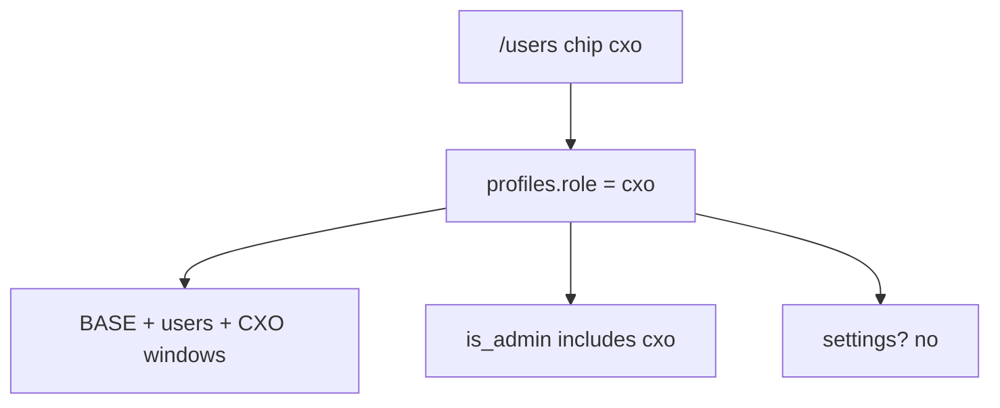

# CXO Role Implementation Plan

> **For agentic workers:** REQUIRED SUB-SKILL: Use superpowers:subagent-driven-development (recommended) or superpowers:executing-plans to implement this plan task-by-task. Steps use checkbox (`- [ ]`) syntax for tracking.

**Goal:** Add an assignable `cxo` role with the same portal permissions as `admin`. Super admin stays separate.

**Architecture:** Extend `ProfileRole` and the Postgres role check. Add `|| role === "cxo"` (or `'cxo'` in SQL) next to each existing admin check. Helpers (`isAdminRole`, `ADMIN_ROLES`, `LEAD_OR_ADMIN_ROLES`, `USER_MANAGER_ROLES`) carry most app behavior. Nav, path access, and CXO manage `requireRole` are updated explicitly.

**Tech Stack:** Next.js 15 App Router, Supabase SQL migration, Vitest, existing `/users` chips.

## Global Constraints

- Role slug and chip label: `cxo`.
- Same powers as `admin`: BASE nav, users, holidays, CXO windows, leave decisions, announcements, burger override, culture admin actions.
- Not `super_admin`: no portal config, no department mutations.
- Visible on `/users`, `/team`, and other people lists. Only `super_admin` stays hidden.
- Assignable by admin, super admin, and cxo. Nobody assigns `super_admin`.
- Add `|| role === "cxo"` next to each admin check. No permissions table.
- `/cxo` booking windows stay typed names. Do not change `CxoClient` or `bookCxo`.
- First user stays `super_admin`. No seed of a cxo user.
- Copy stays lowercase. Follow `docs/DESIGN.md`.



## File map

- Modify: `lib/types.ts`
- Modify: `lib/rls/policies.ts`, `supabase/tests/rls.test.ts`
- Modify: `lib/layout/access.ts`, `lib/layout/access.test.ts`
- Modify: `lib/layout/navItems.ts`, `components/layout/navItems.test.ts`
- Modify: `lib/users/invite.test.ts`
- Modify: `lib/profiles/visible.test.ts`
- Modify: `components/users/UsersClient.tsx`
- Modify: `app/(portal)/cxo/manage/page.tsx`, `app/(portal)/cxo/manage/actions.ts`
- Create: `supabase/migrations/0010_cxo_role.sql`

Do not modify `components/cxo/CxoClient.tsx` or `app/(portal)/cxo/actions.ts`.

---

### Task 1: Type and admin-equivalent helpers

**Files:**
- Modify: `lib/types.ts`
- Modify: `lib/rls/policies.ts`
- Test: `supabase/tests/rls.test.ts`

**Interfaces:**
- Changes: `ProfileRole` includes `"cxo"`
- Changes: `isAdminRole(role)` is true for `"admin"` and `"cxo"`
- Changes: `ADMIN_ROLES = ["admin", "cxo"]`
- Changes: `LEAD_OR_ADMIN_ROLES = ["lead", "admin", "cxo"]`
- Changes: `USER_MANAGER_ROLES = ["admin", "super_admin", "cxo"]`

- [ ] **Step 1: Write the failing tests**

In `supabase/tests/rls.test.ts`, add `isAdminRole` to the import. Extend existing cases and add a cxo block:

```ts
import {
  canDecideLeave,
  canDeleteAnonMessage,
  canInsertAnnouncement,
  canManageCxoWindows,
  canManageDepartments,
  canManageHolidays,
  canManageSettings,
  canManageUsers,
  canSelectTotpCredentials,
  canViewTeamLeaves,
  isAdminRole,
} from "@/lib/rls/policies";
```

In `"employee cannot approve others leaves"`, add:

```ts
    expect(canDecideLeave("cxo")).toBe(true);
```

In `"only leads and admins post announcements"`, add:

```ts
    expect(canInsertAnnouncement("cxo")).toBe(true);
```

In `"admins and super_admins manage users"`, add:

```ts
    expect(canManageUsers("cxo")).toBe(true);
```

In `"only super_admin changes portal settings"`, add:

```ts
    expect(canManageSettings("cxo")).toBe(false);
```

In `"only super_admin manages departments"`, add:

```ts
    expect(canManageDepartments("cxo")).toBe(false);
```

In `"admins and super_admins manage company holidays"`, add:

```ts
    expect(canManageHolidays("cxo")).toBe(true);
```

In `"only admin manages CXO windows"`, add:

```ts
    expect(canManageCxoWindows("cxo")).toBe(true);
```

Add this test at the end of the describe:

```ts
  it("treats cxo as an admin role", () => {
    expect(isAdminRole("cxo")).toBe(true);
    expect(isAdminRole("admin")).toBe(true);
    expect(isAdminRole("employee")).toBe(false);
    expect(isAdminRole("lead")).toBe(false);
    expect(isAdminRole("super_admin")).toBe(false);
  });
```

- [ ] **Step 2: Run test to verify it fails**

Run: `npx vitest run supabase/tests/rls.test.ts`

Expected: FAIL — `"cxo"` is not in `ProfileRole`, and/or `isAdminRole("cxo")` is false / `canManageUsers("cxo")` is false.

- [ ] **Step 3: Minimal implementation**

In `lib/types.ts`:

```ts
export type ProfileRole = "employee" | "lead" | "admin" | "super_admin" | "cxo";
```

In `lib/rls/policies.ts`:

```ts
export const ADMIN_ROLES: ProfileRole[] = ["admin", "cxo"];
export const LEAD_OR_ADMIN_ROLES: ProfileRole[] = ["lead", "admin", "cxo"];
export const USER_MANAGER_ROLES: ProfileRole[] = ["admin", "super_admin", "cxo"];

export function isAdminRole(role: ProfileRole): boolean {
  return role === "admin" || role === "cxo";
}
```

Leave the `can*` functions as they are. They call `isAdminRole`.

- [ ] **Step 4: Run test to verify it passes**

Run: `npx vitest run supabase/tests/rls.test.ts`

Expected: PASS

- [ ] **Step 5: Commit**

```bash
git add lib/types.ts lib/rls/policies.ts supabase/tests/rls.test.ts
git commit -m "feat: treat cxo as an admin-equivalent role"
```

---

### Task 2: Path access for cxo

**Files:**
- Modify: `lib/layout/access.ts`
- Test: `lib/layout/access.test.ts`

**Interfaces:**
- Changes: `canVisitPath` allows `/users` and `/cxo/manage` when `role === "admin" || role === "cxo"`. `/settings` stays false for cxo. `/cxo` stays true.

- [ ] **Step 1: Write the failing test**

Add to `lib/layout/access.test.ts`:

```ts
  it("lets cxo visit the same paths as admin", () => {
    expect(afterAuthPath("cxo")).toBe("/");
    expect(canVisitPath("cxo", "/users")).toBe(true);
    expect(canVisitPath("cxo", "/cxo/manage")).toBe(true);
    expect(canVisitPath("cxo", "/cxo")).toBe(true);
    expect(canVisitPath("cxo", "/settings")).toBe(false);
    expect(canVisitPath("cxo", "/")).toBe(true);
  });
```

- [ ] **Step 2: Run test to verify it fails**

Run: `npx vitest run lib/layout/access.test.ts`

Expected: FAIL — `canVisitPath("cxo", "/users")` and `"/cxo/manage"` are false.

- [ ] **Step 3: Update canVisitPath**

Replace the two admin path checks in `lib/layout/access.ts`:

```ts
  if (path === "/users") return role === "admin" || role === "cxo";
  if (path === "/cxo/manage") return role === "admin" || role === "cxo";
```

- [ ] **Step 4: Run test to verify it passes**

Run: `npx vitest run lib/layout/access.test.ts`

Expected: PASS

- [ ] **Step 5: Commit**

```bash
git add lib/layout/access.ts lib/layout/access.test.ts
git commit -m "feat: let cxo visit users and CXO manage"
```

---

### Task 3: Nav matches admin

**Files:**
- Modify: `lib/layout/navItems.ts`
- Test: `components/layout/navItems.test.ts`

**Interfaces:**
- Changes: `getNavItems("cxo")` returns the same list as `getNavItems("admin")` — 11 items, `cxo-windows` after `users`.

- [ ] **Step 1: Write the failing test**

Add to `components/layout/navItems.test.ts`:

```ts
  it("gives cxo the same nav as admin", () => {
    const admin = getNavItems("admin", 2).map((i) => i.id);
    const cxo = getNavItems("cxo", 2).map((i) => i.id);
    expect(cxo).toHaveLength(11);
    expect(cxo).toEqual(admin);
    expect(cxo.indexOf("cxo-windows")).toBe(cxo.indexOf("users") + 1);
  });
```

- [ ] **Step 2: Run test to verify it fails**

Run: `npx vitest run components/layout/navItems.test.ts`

Expected: FAIL — cxo gets BASE only (9 items), no `users` / `cxo-windows`.

- [ ] **Step 3: Update getNavItems**

In `lib/layout/navItems.ts`:

```ts
export function getNavItems(role: ProfileRole, unreadAnnouncements = 0): (NavItem & { badge: number | null })[] {
  const items =
    role === "super_admin"
      ? [SETTINGS, USERS, HOLIDAYS]
      : role === "admin" || role === "cxo"
        ? [...BASE, USERS, CXO_WINDOWS]
        : BASE;
  return items.map((item) => ({
    ...item,
    badge: item.id === "ann" && unreadAnnouncements > 0 ? unreadAnnouncements : null,
  }));
}
```

- [ ] **Step 4: Run test to verify it passes**

Run: `npx vitest run components/layout/navItems.test.ts`

Expected: PASS

- [ ] **Step 5: Commit**

```bash
git add lib/layout/navItems.ts components/layout/navItems.test.ts
git commit -m "feat: give cxo the same nav as admin"
```

---

### Task 4: Invite and visibility

**Files:**
- Test: `lib/users/invite.test.ts`
- Test: `lib/profiles/visible.test.ts`

**Interfaces:**
- `validateInvite` already rejects only `super_admin`. After Task 1, `role: "cxo"` type-checks. Confirm it returns null.
- `isVisiblePerson` is `role !== "super_admin"`. Confirm `cxo` is visible.

- [ ] **Step 1: Write the failing tests**

In `lib/users/invite.test.ts`, inside the existing `it`, add:

```ts
    expect(
      validateInvite({
        fullName: "Zara Khan",
        email: "zara@halfaccessible.com",
        role: "cxo",
      }),
    ).toBeNull();
```

In `lib/profiles/visible.test.ts`:

```ts
    expect(isVisiblePerson("cxo")).toBe(true);
```

- [ ] **Step 2: Run tests**

Run: `npx vitest run lib/users/invite.test.ts lib/profiles/visible.test.ts`

Expected: PASS (helpers already allow any non-super_admin role). If either fails, stop and fix the helper. Do not add a special-case allow-list that forgets `cxo`.

- [ ] **Step 3: Commit**

```bash
git add lib/users/invite.test.ts lib/profiles/visible.test.ts
git commit -m "test: allow inviting and showing the cxo role"
```

---

### Task 5: Assign chip and CXO manage gate

**Files:**
- Modify: `components/users/UsersClient.tsx`
- Modify: `app/(portal)/cxo/manage/page.tsx`
- Modify: `app/(portal)/cxo/manage/actions.ts`

**Interfaces:**
- Consumes: `ADMIN_ROLES` from `lib/rls/policies.ts`
- Produces: `/users` can assign `cxo`. CXO manage page/actions accept admin and cxo.

- [ ] **Step 1: Add the chip**

In `components/users/UsersClient.tsx`:

```ts
const ROLES: ProfileRole[] = ["employee", "lead", "admin", "cxo"];
```

- [ ] **Step 2: Gate CXO manage with ADMIN_ROLES**

In `app/(portal)/cxo/manage/page.tsx`:

```ts
import { requireRole } from "@/lib/auth";
import { ADMIN_ROLES } from "@/lib/rls/policies";

export default async function CxoManagePage() {
  await requireRole(ADMIN_ROLES);
```

In `app/(portal)/cxo/manage/actions.ts`, add `import { ADMIN_ROLES } from "@/lib/rls/policies";` and replace both `requireRole(["admin"])` with `requireRole(ADMIN_ROLES)`.

Grep the repo (ignore `docs/`):

```bash
rg 'requireRole\(\["admin"\]\)|role === "admin"' --glob '!docs/**'
```

Expected leftover app checks: none that exclude `cxo`. `isAdminRole` / `ADMIN_ROLES` / `LEAD_OR_ADMIN_ROLES` are fine.

- [ ] **Step 3: Run unit suite**

Run: `npx vitest run`

Expected: PASS

- [ ] **Step 4: Commit**

```bash
git add components/users/UsersClient.tsx "app/(portal)/cxo/manage/page.tsx" "app/(portal)/cxo/manage/actions.ts"
git commit -m "feat: assign cxo on users and open CXO manage to cxo"
```

---

### Task 6: Postgres role check and is_admin

**Files:**
- Create: `supabase/migrations/0010_cxo_role.sql`

**Interfaces:**
- Produces: `profiles.role` may be `'cxo'`. `is_admin()` and `is_lead_or_admin()` include `'cxo'`.

- [ ] **Step 1: Write the migration**

Create `supabase/migrations/0010_cxo_role.sql`:

```sql
alter table public.profiles drop constraint if exists profiles_role_check;
alter table public.profiles
  add constraint profiles_role_check
  check (role in ('employee', 'lead', 'admin', 'super_admin', 'cxo'));

create or replace function public.is_lead_or_admin()
returns boolean
language sql
stable
as $$
  select public.current_profile_role() in ('lead', 'admin', 'cxo')
$$;

create or replace function public.is_admin()
returns boolean
language sql
stable
as $$
  select public.current_profile_role() in ('admin', 'cxo')
$$;
```

- [ ] **Step 2: Apply locally if supabase is available**

Run: `npx supabase db query --linked false -f supabase/migrations/0010_cxo_role.sql` only if that CLI flow is already how this repo applies migrations. Otherwise leave the file for the usual migrate path. Do not invent a new apply command.

If `npx supabase migration list` or the project README says to use `npx supabase db reset` / `migration up`, use that. The deliverable is the file matching `0004` / `0005` style.

- [ ] **Step 3: Commit**

```bash
git add supabase/migrations/0010_cxo_role.sql
git commit -m "feat: allow cxo in profiles role and SQL admin checks"
```

---

## Self-review

Spec coverage:

- `ProfileRole` + constraint + `is_admin` / `is_lead_or_admin` → Tasks 1 and 6
- `isAdminRole`, role arrays, can* for cxo → Task 1
- `canVisitPath` → Task 2
- `getNavItems` → Task 3
- invite + visibility → Task 4
- `/users` chip + CXO manage `requireRole` → Task 5
- Settings/departments stay super admin → Task 1 tests
- Booking UI unchanged → no task touches those files

No placeholders. Names match: `cxo`, `ADMIN_ROLES`, `0010_cxo_role.sql`.
