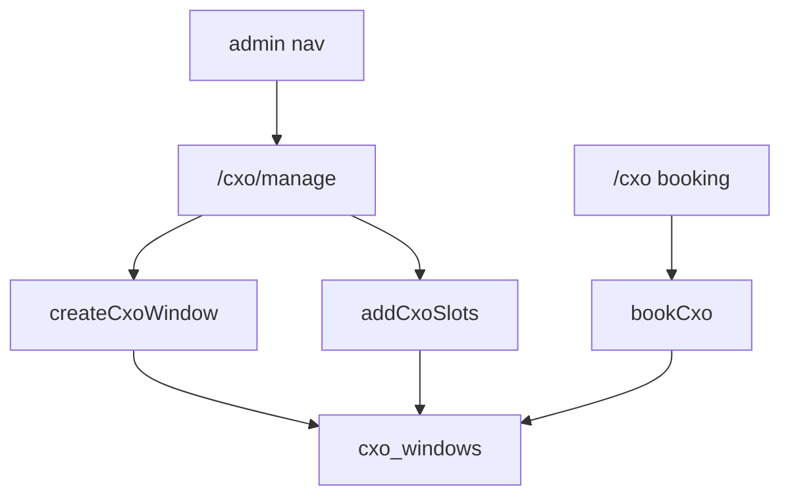

# CXO Window Management Implementation Plan

> **For agentic workers:** REQUIRED SUB-SKILL: Use superpowers:subagent-driven-development (recommended) or superpowers:executing-plans to implement this plan task-by-task. Steps use checkbox (`- [ ]`) syntax for tracking.

**Goal:** Let admin create CXO booking windows and add slots from `/cxo/manage`, while employees keep booking on `/cxo`.

**Architecture:** Pure validators in `lib/cxo/validate.ts` format the date+note label and check slot counts. Admin-only nav and `canVisitPath` expose `/cxo/manage`. Server actions use `requireRole(["admin"])` and the service-role client to insert rows or increment `slots_remaining`. No schema change and no new write RLS.

**Tech Stack:** Next.js 15 App Router, Supabase service-role client, Vitest, Playwright, existing TextField / Button / Avatar / Toast / EmptyState.

## Global Constraints

- `/cxo` stays the booking page. Do not change `CxoClient` or `bookCxo`.
- `/cxo/manage` is admin only. Super admin, lead, and employee cannot visit it.
- Nav item: `id: "cxo-windows"`, `href: "/cxo/manage"`, `label` and `title`: `CXO windows`, `sub`: `drop a window. add slots.` Admin list is `[...BASE, USERS, CXO_WINDOWS]` (11 items).
- Typed CXO identity: name, title, tagline. They do not have to be a portal user.
- Window time is a date plus an optional short note, stored as `window_label` text. No new columns.
- Slot count on create and top-up is 1–20. Past dates are allowed. Duplicate person+date is allowed.
- New windows use `AVATAR_SWATCHES`. Seed windows keep their colors.
- Writes: `requireRole(["admin"])` + `createAdminClient()`. Do not add authenticated insert/update RLS for create or top-up.
- Copy is lowercase and casual. Cards 12px. No new motion. Follow `docs/DESIGN.md`.
- No edit, close, or delete.



## File map

- Create: `lib/cxo/validate.ts`, `lib/cxo/validate.test.ts`
- Modify: `lib/rls/policies.ts`, `supabase/tests/rls.test.ts`
- Modify: `lib/layout/access.ts`, `lib/layout/access.test.ts`
- Modify: `lib/layout/navItems.ts`, `components/layout/navItems.test.ts`
- Create: `app/(portal)/cxo/manage/actions.ts`
- Create: `app/(portal)/cxo/manage/page.tsx`
- Create: `components/cxo/CxoManageClient.tsx`
- Create: `e2e/cxo.spec.ts`

Do not modify `app/(portal)/cxo/actions.ts`, `components/cxo/CxoClient.tsx`, or add a SQL migration.

---

### Task 1: CXO window validators

**Files:**
- Create: `lib/cxo/validate.ts`
- Test: `lib/cxo/validate.test.ts`

**Interfaces:**
- Produces:
  - `CXO_NAME_MAX = 40`, `CXO_TITLE_MAX = 20`, `CXO_TAGLINE_MAX = 80`, `CXO_NOTE_MAX = 40`
  - `validateCxoName(name: string): string | null`
  - `validateCxoTitle(title: string): string | null`
  - `validateCxoTagline(tagline: string): string | null`
  - `validateCxoDate(iso: string): string | null`
  - `validateCxoNote(note: string): string | null`
  - `validateCxoSlotCount(n: unknown): string | null`
  - `validateCxoColor(color: string): string | null`
  - `formatCxoWindowLabel(iso: string, note: string): string`
  - `nextSlotsRemaining(current: number, add: number): number`
  - `CxoWindowInput` type and `validateCxoWindow(input: CxoWindowInput): string | null`
  - `cxoSlotCount(n: unknown): number` — call only after `validateCxoSlotCount` is null

- [ ] **Step 1: Write the failing test**

Create `lib/cxo/validate.test.ts`:

```ts
import { describe, expect, it } from "vitest";
import {
  CXO_NAME_MAX,
  CXO_NOTE_MAX,
  CXO_TAGLINE_MAX,
  CXO_TITLE_MAX,
  formatCxoWindowLabel,
  nextSlotsRemaining,
  validateCxoColor,
  validateCxoDate,
  validateCxoName,
  validateCxoNote,
  validateCxoSlotCount,
  validateCxoTagline,
  validateCxoTitle,
  validateCxoWindow,
} from "./validate";

describe("cxo name", () => {
  it("requires a trimmed name of at most CXO_NAME_MAX chars", () => {
    expect(validateCxoName("  ")).toBe("name required");
    expect(validateCxoName("x".repeat(CXO_NAME_MAX + 1))).toBe("name too long");
    expect(validateCxoName("  Nikhil Verma  ")).toBeNull();
  });
});

describe("cxo title", () => {
  it("requires a trimmed title of at most CXO_TITLE_MAX chars", () => {
    expect(validateCxoTitle("  ")).toBe("title required");
    expect(validateCxoTitle("x".repeat(CXO_TITLE_MAX + 1))).toBe("title too long");
    expect(validateCxoTitle("CEO")).toBeNull();
  });
});

describe("cxo tagline", () => {
  it("requires a trimmed tagline of at most CXO_TAGLINE_MAX chars", () => {
    expect(validateCxoTagline("  ")).toBe("tagline required");
    expect(validateCxoTagline("x".repeat(CXO_TAGLINE_MAX + 1))).toBe("tagline too long");
    expect(validateCxoTagline("asks why a lot")).toBeNull();
  });
});

describe("cxo date", () => {
  it("requires a real YYYY-MM-DD date", () => {
    expect(validateCxoDate("")).toBe("date required");
    expect(validateCxoDate("2026-13-01")).toBe("invalid date");
    expect(validateCxoDate("2026-02-31")).toBe("invalid date");
    expect(validateCxoDate("2026-08-21")).toBeNull();
  });
});

describe("cxo note", () => {
  it("allows empty and rejects over CXO_NOTE_MAX", () => {
    expect(validateCxoNote("")).toBeNull();
    expect(validateCxoNote("   ")).toBeNull();
    expect(validateCxoNote("x".repeat(CXO_NOTE_MAX + 1))).toBe("note too long");
    expect(validateCxoNote("after all-hands")).toBeNull();
  });
});

describe("cxo slots", () => {
  it("requires an integer from 1 to 20", () => {
    expect(validateCxoSlotCount(0)).toBe("slots must be 1-20");
    expect(validateCxoSlotCount(21)).toBe("slots must be 1-20");
    expect(validateCxoSlotCount(1.5)).toBe("slots must be 1-20");
    expect(validateCxoSlotCount("1.5")).toBe("slots must be 1-20");
    expect(validateCxoSlotCount(1)).toBeNull();
    expect(validateCxoSlotCount(20)).toBeNull();
    expect(validateCxoSlotCount("3")).toBeNull();
  });
});

describe("cxo color", () => {
  it("requires a portal swatch", () => {
    expect(validateCxoColor("#1C1C2E")).toBe("invalid color");
    expect(validateCxoColor("#7048B6")).toBeNull();
  });
});

describe("cxo window label", () => {
  it("formats UTC month and day, with an optional note", () => {
    expect(formatCxoWindowLabel("2026-08-21", "")).toBe("Aug 21");
    expect(formatCxoWindowLabel("2026-08-21", "  after all-hands  ")).toBe("Aug 21 · after all-hands");
  });
});

describe("cxo slot math", () => {
  it("adds to remaining without a cap", () => {
    expect(nextSlotsRemaining(2, 3)).toBe(5);
  });
});

describe("cxo window", () => {
  it("returns the first field error", () => {
    expect(
      validateCxoWindow({
        name: "",
        title: "CEO",
        tagline: "why",
        date: "2026-08-21",
        note: "",
        slots: 1,
        color: "#7048B6",
      }),
    ).toBe("name required");
    expect(
      validateCxoWindow({
        name: "Nikhil",
        title: "CEO",
        tagline: "why",
        date: "2026-08-21",
        note: "",
        slots: 1,
        color: "#7048B6",
      }),
    ).toBeNull();
  });
});
```

- [ ] **Step 2: Run test to verify it fails**

Run: `npx vitest run lib/cxo/validate.test.ts`

Expected: FAIL with `Cannot find module './validate'`

- [ ] **Step 3: Write minimal implementation**

Create `lib/cxo/validate.ts`:

```ts
import { validateHolidayDate } from "@/lib/holidays/validate";
import { AVATAR_SWATCHES } from "@/lib/profiles/details";

export const CXO_NAME_MAX = 40;
export const CXO_TITLE_MAX = 20;
export const CXO_TAGLINE_MAX = 80;
export const CXO_NOTE_MAX = 40;

export type CxoWindowInput = {
  name: string;
  title: string;
  tagline: string;
  date: string;
  note: string;
  slots: unknown;
  color: string;
};

export function validateCxoName(name: string): string | null {
  const trimmed = name.trim();
  if (!trimmed) return "name required";
  if (trimmed.length > CXO_NAME_MAX) return "name too long";
  return null;
}

export function validateCxoTitle(title: string): string | null {
  const trimmed = title.trim();
  if (!trimmed) return "title required";
  if (trimmed.length > CXO_TITLE_MAX) return "title too long";
  return null;
}

export function validateCxoTagline(tagline: string): string | null {
  const trimmed = tagline.trim();
  if (!trimmed) return "tagline required";
  if (trimmed.length > CXO_TAGLINE_MAX) return "tagline too long";
  return null;
}

export function validateCxoDate(iso: string): string | null {
  return validateHolidayDate(iso);
}

export function validateCxoNote(note: string): string | null {
  if (note.trim().length > CXO_NOTE_MAX) return "note too long";
  return null;
}

export function validateCxoSlotCount(n: unknown): string | null {
  if (typeof n === "number") {
    if (!Number.isInteger(n) || n < 1 || n > 20) return "slots must be 1-20";
    return null;
  }
  const raw = String(n ?? "").trim();
  if (!/^\d+$/.test(raw)) return "slots must be 1-20";
  const value = Number.parseInt(raw, 10);
  if (value < 1 || value > 20) return "slots must be 1-20";
  return null;
}

export function cxoSlotCount(n: unknown): number {
  return typeof n === "number" ? n : Number.parseInt(String(n).trim(), 10);
}

export function validateCxoColor(color: string): string | null {
  if (!AVATAR_SWATCHES.includes(color as (typeof AVATAR_SWATCHES)[number])) {
    return "invalid color";
  }
  return null;
}

export function formatCxoWindowLabel(iso: string, note: string): string {
  const [y, m, d] = iso.split("-").map(Number);
  const date = new Date(Date.UTC(y, m - 1, d)).toLocaleString("en-US", {
    month: "short",
    day: "numeric",
    timeZone: "UTC",
  });
  const extra = note.trim();
  return extra ? `${date} · ${extra}` : date;
}

export function nextSlotsRemaining(current: number, add: number): number {
  return current + add;
}

export function validateCxoWindow(input: CxoWindowInput): string | null {
  return (
    validateCxoName(input.name) ??
    validateCxoTitle(input.title) ??
    validateCxoTagline(input.tagline) ??
    validateCxoDate(input.date) ??
    validateCxoNote(input.note) ??
    validateCxoSlotCount(input.slots) ??
    validateCxoColor(input.color)
  );
}
```

- [ ] **Step 4: Run test to verify it passes**

Run: `npx vitest run lib/cxo/validate.test.ts`

Expected: PASS

- [ ] **Step 5: Commit**

```bash
git add lib/cxo/validate.ts lib/cxo/validate.test.ts
git commit -m "feat: validate CXO window fields and slot counts"
```

---

### Task 2: Admin-only manage capability

**Files:**
- Modify: `lib/rls/policies.ts`
- Test: `supabase/tests/rls.test.ts`

**Interfaces:**
- Produces: `canManageCxoWindows(role: ProfileRole): boolean` — true only for `admin`

- [ ] **Step 1: Write the failing test**

In `supabase/tests/rls.test.ts`, add `canManageCxoWindows` to the import from `@/lib/rls/policies`, then add:

```ts
it("only admin manages CXO windows", () => {
  expect(canManageCxoWindows("employee")).toBe(false);
  expect(canManageCxoWindows("lead")).toBe(false);
  expect(canManageCxoWindows("admin")).toBe(true);
  expect(canManageCxoWindows("super_admin")).toBe(false);
});
```

- [ ] **Step 2: Run test to verify it fails**

Run: `npx vitest run supabase/tests/rls.test.ts`

Expected: FAIL with `canManageCxoWindows is not a function` or a compile error

- [ ] **Step 3: Add the helper**

In `lib/rls/policies.ts`, after `canManageHolidays`:

```ts
export function canManageCxoWindows(role: ProfileRole): boolean {
  return isAdminRole(role);
}
```

- [ ] **Step 4: Run test to verify it passes**

Run: `npx vitest run supabase/tests/rls.test.ts`

Expected: PASS

- [ ] **Step 5: Commit**

```bash
git add lib/rls/policies.ts supabase/tests/rls.test.ts
git commit -m "feat: gate CXO window management to admin"
```

---

### Task 3: Block /cxo/manage for everyone except admin

**Files:**
- Modify: `lib/layout/access.ts`
- Test: `lib/layout/access.test.ts`

**Interfaces:**
- Changes: `canVisitPath(role: ProfileRole, path: string): boolean` — `/cxo/manage` is true only for `admin`. `/cxo` unchanged.

- [ ] **Step 1: Write the failing test**

Add to `lib/layout/access.test.ts`:

```ts
it("lets only admin visit CXO manage", () => {
  expect(canVisitPath("admin", "/cxo/manage")).toBe(true);
  expect(canVisitPath("admin", "/cxo")).toBe(true);
  expect(canVisitPath("employee", "/cxo/manage")).toBe(false);
  expect(canVisitPath("lead", "/cxo/manage")).toBe(false);
  expect(canVisitPath("super_admin", "/cxo/manage")).toBe(false);
  expect(canVisitPath("employee", "/cxo")).toBe(true);
});
```

- [ ] **Step 2: Run test to verify it fails**

Run: `npx vitest run lib/layout/access.test.ts`

Expected: FAIL — employee/lead currently get `true` for `/cxo/manage`

- [ ] **Step 3: Update canVisitPath**

Replace `canVisitPath` in `lib/layout/access.ts` with:

```ts
export function canVisitPath(role: ProfileRole, path: string): boolean {
  if (role === "super_admin") {
    return path === "/settings" || path === "/users" || path === "/holidays";
  }
  if (path === "/settings") return false;
  if (path === "/users") return role === "admin";
  if (path === "/cxo/manage") return role === "admin";
  return true;
}
```

- [ ] **Step 4: Run test to verify it passes**

Run: `npx vitest run lib/layout/access.test.ts`

Expected: PASS

- [ ] **Step 5: Commit**

```bash
git add lib/layout/access.ts lib/layout/access.test.ts
git commit -m "feat: restrict /cxo/manage to admin"
```

---

### Task 4: Admin nav item for CXO windows

**Files:**
- Modify: `lib/layout/navItems.ts`
- Test: `components/layout/navItems.test.ts`

**Interfaces:**
- Produces: nav item `{ id: "cxo-windows", href: "/cxo/manage", label: "CXO windows", title: "CXO windows", sub: "drop a window. add slots." }`
- Changes: `getNavItems("admin")` is `[...BASE, USERS, CXO_WINDOWS]` (11 items). Employee stays 9. Super admin stays `["settings", "users", "holidays"]`.

- [ ] **Step 1: Write the failing test**

In `components/layout/navItems.test.ts`, change the admin length assertion from `10` to `11` and add the placement check. Full file:

```ts
import { describe, expect, it } from "vitest";
import { getNavItems } from "@/lib/layout/navItems";

describe("getNavItems", () => {
  it("gives employees 9 items including holidays and no user management", () => {
    const items = getNavItems("employee", 0);
    expect(items).toHaveLength(9);
    expect(items.some((i) => i.id === "holidays")).toBe(true);
    expect(items.some((i) => i.id === "users")).toBe(false);
    expect(items.some((i) => i.id === "cxo-windows")).toBe(false);
  });

  it("gives admins 11 items including holidays, user management, and CXO windows", () => {
    const items = getNavItems("admin", 2);
    expect(items).toHaveLength(11);
    expect(items.some((i) => i.id === "holidays")).toBe(true);
    expect(items.some((i) => i.id === "users")).toBe(true);
    expect(items.some((i) => i.id === "settings")).toBe(false);
    expect(items.find((i) => i.id === "ann")?.badge).toBe(2);
    const ids = items.map((i) => i.id);
    expect(ids.indexOf("cxo-windows")).toBe(ids.indexOf("users") + 1);
  });

  it("gives super_admin portal config, user management, and holidays", () => {
    expect(getNavItems("super_admin", 2).map((i) => i.id)).toEqual([
      "settings",
      "users",
      "holidays",
    ]);
  });

  it("hides portal config from employees", () => {
    expect(getNavItems("employee").some((i) => i.id === "settings")).toBe(false);
  });

  it("uses v2 canvas titles", () => {
    const items = getNavItems("admin");
    expect(items.find((i) => i.id === "burgers")?.title).toBe("burger holidays 🍔");
    expect(items.find((i) => i.id === "users")?.sub).toBe("admin only. handle with care 🧤");
    expect(items.find((i) => i.id === "holidays")?.title).toBe("holiday calendar");
    expect(items.find((i) => i.id === "cxo-windows")?.title).toBe("CXO windows");
    expect(items.find((i) => i.id === "cxo-windows")?.sub).toBe("drop a window. add slots.");
    expect(items.find((i) => i.id === "cxo-windows")?.href).toBe("/cxo/manage");
  });
});
```

- [ ] **Step 2: Run test to verify it fails**

Run: `npx vitest run components/layout/navItems.test.ts`

Expected: FAIL — admin length is 10, no `cxo-windows`

- [ ] **Step 3: Add the nav item**

In `lib/layout/navItems.ts`, after the `USERS` const:

```ts
const CXO_WINDOWS: NavItem = {
  id: "cxo-windows",
  href: "/cxo/manage",
  label: "CXO windows",
  title: "CXO windows",
  sub: "drop a window. add slots.",
};
```

Change `getNavItems` admin branch from `[...BASE, USERS]` to `[...BASE, USERS, CXO_WINDOWS]`:

```ts
export function getNavItems(role: ProfileRole, unreadAnnouncements = 0): (NavItem & { badge: number | null })[] {
  const items =
    role === "super_admin" ? [SETTINGS, USERS, HOLIDAYS] : role === "admin" ? [...BASE, USERS, CXO_WINDOWS] : BASE;
  return items.map((item) => ({
    ...item,
    badge: item.id === "ann" && unreadAnnouncements > 0 ? unreadAnnouncements : null,
  }));
}
```

- [ ] **Step 4: Run test to verify it passes**

Run: `npx vitest run components/layout/navItems.test.ts`

Expected: PASS

- [ ] **Step 5: Commit**

```bash
git add lib/layout/navItems.ts components/layout/navItems.test.ts
git commit -m "feat: add CXO windows nav item for admin"
```

---

### Task 5: Create and top-up actions

**Files:**
- Create: `app/(portal)/cxo/manage/actions.ts`

**Interfaces:**
- Consumes: `validateCxoWindow`, `formatCxoWindowLabel`, `cxoSlotCount`, `nextSlotsRemaining`, `validateCxoSlotCount` from `lib/cxo/validate.ts`
- Produces:
  - `createCxoWindow(formData: FormData): Promise<{ ok: true } | { ok: false, error: string }>`
  - `addCxoSlots(id: string, count: unknown): Promise<{ ok: true } | { ok: false, error: string }>`

- [ ] **Step 1: Write the actions**

There is no isolated action test in this repo (same as holidays). Helpers from Task 1 cover validation. Create `app/(portal)/cxo/manage/actions.ts`:

```ts
"use server";

import { revalidatePath } from "next/cache";
import { requireRole } from "@/lib/auth";
import {
  cxoSlotCount,
  formatCxoWindowLabel,
  nextSlotsRemaining,
  validateCxoSlotCount,
  validateCxoWindow,
} from "@/lib/cxo/validate";
import { createAdminClient } from "@/lib/supabase/admin";

function revalidateCxo() {
  revalidatePath("/cxo");
  revalidatePath("/cxo/manage");
}

export async function createCxoWindow(formData: FormData) {
  await requireRole(["admin"]);
  const name = String(formData.get("name") ?? "");
  const title = String(formData.get("title") ?? "");
  const tagline = String(formData.get("tagline") ?? "");
  const date = String(formData.get("date") ?? "");
  const note = String(formData.get("note") ?? "");
  const slots = formData.get("slots");
  const color = String(formData.get("color") ?? "");
  const error = validateCxoWindow({ name, title, tagline, date, note, slots, color });
  if (error) return { ok: false as const, error };
  const admin = createAdminClient();
  const { error: insertError } = await admin.from("cxo_windows").insert({
    name: name.trim(),
    title: title.trim(),
    tagline: tagline.trim(),
    avatar_color: color,
    window_label: formatCxoWindowLabel(date, note),
    slots_remaining: cxoSlotCount(slots),
  });
  if (insertError) return { ok: false as const, error: insertError.message };
  revalidateCxo();
  return { ok: true as const };
}

export async function addCxoSlots(id: string, count: unknown) {
  await requireRole(["admin"]);
  if (!id) return { ok: false as const, error: "missing window" };
  if (validateCxoSlotCount(count)) return { ok: false as const, error: "slots must be 1-20" };
  const admin = createAdminClient();
  const { data } = await admin.from("cxo_windows").select("slots_remaining").eq("id", id).maybeSingle();
  if (!data) return { ok: false as const, error: "missing window" };
  const { error } = await admin
    .from("cxo_windows")
    .update({ slots_remaining: nextSlotsRemaining(data.slots_remaining, cxoSlotCount(count)) })
    .eq("id", id);
  if (error) return { ok: false as const, error: error.message };
  revalidateCxo();
  return { ok: true as const };
}
```

- [ ] **Step 2: Typecheck the new file**

Run: `npx tsc --noEmit --pretty false 2>&1 | rg "cxo/manage/actions" || true`

Expected: no errors mentioning `app/(portal)/cxo/manage/actions.ts`

- [ ] **Step 3: Commit**

```bash
git add app/\(portal\)/cxo/manage/actions.ts
git commit -m "feat: add admin actions to create CXO windows and slots"
```

---

### Task 6: Manage page UI

**Files:**
- Create: `app/(portal)/cxo/manage/page.tsx`
- Create: `components/cxo/CxoManageClient.tsx`

**Interfaces:**
- Consumes: `createCxoWindow`, `addCxoSlots`, `AVATAR_SWATCHES`, `CXO_*_MAX` constants
- Produces: admin page that lists windows and drops new ones

- [ ] **Step 1: Create the page**

Create `app/(portal)/cxo/manage/page.tsx`:

```ts
import { CxoManageClient } from "@/components/cxo/CxoManageClient";
import { requireRole } from "@/lib/auth";
import { createClient } from "@/lib/supabase/server";

export default async function CxoManagePage() {
  await requireRole(["admin"]);
  const supabase = await createClient();
  const { data } = await supabase
    .from("cxo_windows")
    .select("id, name, title, tagline, avatar_color, window_label, slots_remaining")
    .order("name")
    .order("window_label");
  return <CxoManageClient windows={data ?? []} />;
}
```

- [ ] **Step 2: Create the client**

Create `components/cxo/CxoManageClient.tsx`:

```tsx
"use client";

import { useState } from "react";
import { addCxoSlots, createCxoWindow } from "@/app/(portal)/cxo/manage/actions";
import { Avatar } from "@/components/ui/Avatar";
import { Button } from "@/components/ui/Button";
import { EmptyState } from "@/components/ui/EmptyState";
import { TextField } from "@/components/ui/TextField";
import { Toast } from "@/components/ui/Toast";
import {
  CXO_NAME_MAX,
  CXO_NOTE_MAX,
  CXO_TAGLINE_MAX,
  CXO_TITLE_MAX,
} from "@/lib/cxo/validate";
import { initials } from "@/lib/names";
import { AVATAR_SWATCHES } from "@/lib/profiles/details";
import { CalendarBlank } from "@phosphor-icons/react";

export type CxoWindowRow = {
  id: string;
  name: string;
  title: string;
  tagline: string;
  avatar_color: string;
  window_label: string;
  slots_remaining: number;
};

export function CxoManageClient({ windows }: { windows: CxoWindowRow[] }) {
  const [toast, setToast] = useState<string | null>(null);
  const [color, setColor] = useState<(typeof AVATAR_SWATCHES)[number]>(AVATAR_SWATCHES[0]);
  const [formKey, setFormKey] = useState(0);

  return (
    <div className="pageEnter mx-auto max-w-[720px]">
      <form
        key={formKey}
        className="mb-5 rounded-ha-lg border border-ha-accent/30 bg-ha-surface p-[22px] shadow-[var(--ha-shadow-card)]"
        action={async (fd) => {
          const r = await createCxoWindow(fd);
          setToast(r.ok ? "window dropped" : r.error ?? "nope");
          if (r.ok) {
            setColor(AVATAR_SWATCHES[0]);
            setFormKey((k) => k + 1);
          }
        }}
      >
        <div className="mb-3 font-[family-name:var(--font-display)] text-base font-bold">
          drop a window
        </div>
        <TextField name="name" label="name" maxLength={CXO_NAME_MAX} required />
        <div className="h-2.5" />
        <TextField name="title" label="title" maxLength={CXO_TITLE_MAX} required />
        <div className="h-2.5" />
        <TextField name="tagline" label="tagline" maxLength={CXO_TAGLINE_MAX} required />
        <div className="h-2.5" />
        <TextField name="date" label="date" type="date" required />
        <div className="h-2.5" />
        <TextField name="note" label="note" maxLength={CXO_NOTE_MAX} />
        <div className="h-2.5" />
        <TextField name="slots" label="slots" type="number" min={1} max={20} defaultValue={1} required />
        <input type="hidden" name="color" value={color} />
        <div className="mt-3 flex flex-wrap gap-2">
          {AVATAR_SWATCHES.map((c) => (
            <button
              key={c}
              type="button"
              aria-label="pick avatar color"
              onClick={() => setColor(c)}
              className="h-[34px] w-[34px] rounded-full"
              style={{
                background: c,
                border: color === c ? "3px solid var(--ha-ink)" : "3px solid transparent",
              }}
            />
          ))}
        </div>
        <div className="mt-3.5">
          <Button type="submit">drop it</Button>
        </div>
      </form>
      <div className="rounded-ha-lg border border-ha-line bg-ha-surface p-[22px] shadow-[var(--ha-shadow-card)]">
        <div className="mb-3.5 font-[family-name:var(--font-display)] text-base font-bold">
          windows
        </div>
        {windows.length === 0 ? (
          <EmptyState icon={<CalendarBlank size={28} />} title="no windows yet" />
        ) : (
          windows.map((cx) => (
            <form
              key={cx.id}
              className="flex flex-wrap items-end gap-3 border-b border-ha-line py-2.5 last:border-b-0"
              action={async (fd) => {
                const r = await addCxoSlots(cx.id, fd.get("count"));
                setToast(r.ok ? "slots added" : r.error ?? "nope");
              }}
            >
              <Avatar initials={initials(cx.name)} color={cx.avatar_color} />
              <span className="min-w-0 flex-1">
                <span className="block text-[13.5px] font-semibold">{cx.name}</span>
                <span className="block text-xs text-ha-muted">
                  {cx.title} · {cx.window_label} · {cx.slots_remaining} slots
                </span>
              </span>
              <TextField
                name="count"
                label="slots"
                type="number"
                min={1}
                max={20}
                defaultValue={1}
                className="w-24"
              />
              <Button type="submit">add slots</Button>
            </form>
          ))
        )}
      </div>
      <Toast message={toast} />
    </div>
  );
}
```

- [ ] **Step 3: Run unit tests**

Run: `npx vitest run`

Expected: PASS (existing suite plus Tasks 1–4)

- [ ] **Step 4: Commit**

```bash
git add app/\(portal\)/cxo/manage/page.tsx components/cxo/CxoManageClient.tsx
git commit -m "feat: add admin CXO window manage page"
```

---

### Task 7: Public redirect for /cxo/manage

**Files:**
- Create: `e2e/cxo.spec.ts`

**Interfaces:**
- Produces: logged-out visit to `/cxo/manage` lands on login

- [ ] **Step 1: Write the failing test**

Create `e2e/cxo.spec.ts`:

```ts
import { expect, test } from "@playwright/test";

test("cxo manage page is not public", async ({ page }) => {
  await page.goto("/cxo/manage");
  await expect(page).toHaveURL(/login/);
});
```

- [ ] **Step 2: Run the test**

Run: `npx playwright test e2e/cxo.spec.ts`

Expected: PASS once the manage route exists (Task 6). If the route is missing, Next may 404 instead of login — that is a FAIL. After Task 6, unauthenticated portal pages redirect to login the same way as `/users` and `/holidays`.

- [ ] **Step 3: Commit**

```bash
git add e2e/cxo.spec.ts
git commit -m "test: keep CXO manage behind login"
```

---

## Self-review

Spec coverage:

- Validators, label, slot math → Task 1
- `canManageCxoWindows` → Task 2
- `canVisitPath("/cxo/manage")` → Task 3
- Nav item and admin count 11 → Task 4
- `createCxoWindow` / `addCxoSlots` service-role, no new RLS → Task 5
- Manage UI, toasts, form reset, empty state → Task 6
- Playwright login redirect → Task 7
- `/cxo` booking unchanged → no task touches those files
- Out of scope (edit/delete, roster pick, schema, super_admin, authenticated e2e) → no tasks

No placeholders. Names match across tasks: `createCxoWindow`, `addCxoSlots`, `cxoSlotCount`, `CXO_WINDOWS` / `cxo-windows`, `/cxo/manage`.
