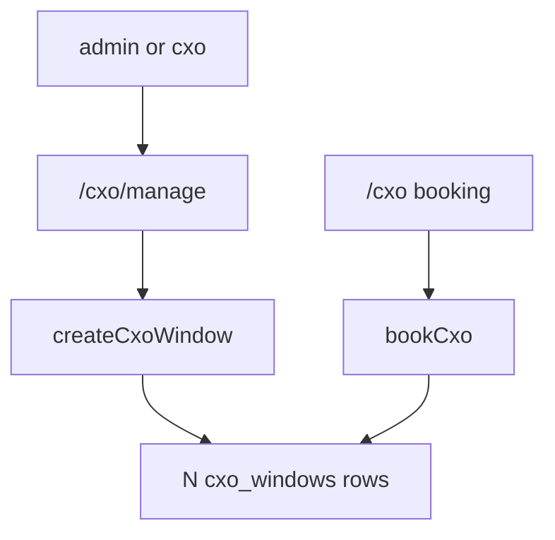

# CXO 15-minute Slots Implementation Plan

> **For agentic workers:** REQUIRED SUB-SKILL: Use superpowers:subagent-driven-development (recommended) or superpowers:executing-plans to implement this plan task-by-task. Steps use checkbox (`- [ ]`) syntax for tracking.

**Goal:** Drop a CXO start time and slot count so everyone sees one 15-minute window per slot on `/cxo`.

**Architecture:** Pure helpers in `lib/cxo/validate.ts` parse a wall-clock `datetime-local` string, reject off-grid minutes, and emit one label per 15-minute step. `createCxoWindow` inserts that many `cxo_windows` rows in one batch. Manage UI is dropdown + start + slots. `bookCxo` and `/cxo` stay as they are.

**Tech Stack:** Next.js 15 App Router, Supabase service-role client, Vitest, Playwright, existing TextField / Button / Avatar / Toast / EmptyState.

## Global Constraints

- `/cxo` stays the booking page. Do not change `CxoClient` or `bookCxo`.
- Create fields are only: CXO dropdown, start (`datetime-local`), slots (`1–20`, default `1`).
- One `cxo_windows` row per 15-minute slot. `slots_remaining` is `1`. No migration.
- Start is wall-clock `YYYY-MM-DDTHH:mm`. Do not shift it through local/UTC `Date` conversion.
- Name/title/color come from the selected CXO profile. Tagline is always `15 minutes. no agenda.`
- Delete `addCxoSlots`. Nav sub is `drop a window.`
- `requireRole(ADMIN_ROLES)` + `createAdminClient()`. No new write RLS.
- Copy is lowercase and casual. Follow `docs/DESIGN.md`. No new motion or color tokens.



## File map

- Modify: `lib/cxo/validate.ts`, `lib/cxo/validate.test.ts`
- Modify: `lib/layout/navItems.ts`, `components/layout/navItems.test.ts`
- Modify: `app/(portal)/cxo/manage/actions.ts`
- Modify: `components/cxo/CxoManageClient.tsx`
- Do not modify: `app/(portal)/cxo/actions.ts`, `components/cxo/CxoClient.tsx`, SQL migrations

---

### Task 1: Start time, labels, and derived fields

**Files:**
- Modify: `lib/cxo/validate.ts`
- Test: `lib/cxo/validate.test.ts`

**Interfaces:**
- Produces:
  - `CXO_SLOT_TAGLINE = "15 minutes. no agenda."`
  - `CxoWindowInput = { name: string; start: string; slots: unknown }`
  - `validateCxoStart(raw: string): string | null`
  - `formatCxoSlotLabel(raw: string): string`
  - `cxoSlotStarts(raw: string, count: number): string[]`
  - `cxoTitleFromDesignation(designation: string): string`
  - `cxoColorFromProfile(color: string): string`
  - `validateCxoWindow(input: CxoWindowInput): string | null`
- Keeps: `CXO_NAME_MAX`, `CXO_TITLE_MAX`, `validateCxoName`, `validateCxoSlotCount`, `cxoSlotCount`
- Removes from this module once unused: `formatCxoWindowLabel`, `validateCxoDate`, `validateCxoNote`, `nextSlotsRemaining`, `CXO_NOTE_MAX`

- [ ] **Step 1: Write the failing tests**

Replace the date/note/label/slot-math/window cases in `lib/cxo/validate.test.ts` with:

```ts
import { describe, expect, it } from "vitest";
import { AVATAR_SWATCHES } from "@/lib/profiles/details";
import {
  CXO_NAME_MAX,
  CXO_TITLE_MAX,
  cxoColorFromProfile,
  cxoSlotStarts,
  cxoTitleFromDesignation,
  formatCxoSlotLabel,
  validateCxoName,
  validateCxoSlotCount,
  validateCxoStart,
  validateCxoWindow,
} from "./validate";

describe("cxo name", () => {
  it("requires a trimmed name of at most CXO_NAME_MAX chars", () => {
    expect(validateCxoName("  ")).toBe("name required");
    expect(validateCxoName("x".repeat(CXO_NAME_MAX + 1))).toBe("name too long");
    expect(validateCxoName("  Nikhil Verma  ")).toBeNull();
  });
});

describe("cxo start", () => {
  it("requires a real datetime on a 15-min mark", () => {
    expect(validateCxoStart("")).toBe("start required");
    expect(validateCxoStart("2026-13-01T16:00")).toBe("invalid start");
    expect(validateCxoStart("2026-02-31T16:00")).toBe("invalid start");
    expect(validateCxoStart("2026-08-21T16:07")).toBe("start must be on a 15-min mark");
    expect(validateCxoStart("2026-08-21T16:00")).toBeNull();
    expect(validateCxoStart("2026-08-21T16:15")).toBeNull();
  });
});

describe("cxo slots", () => {
  it("requires an integer from 1 to 20", () => {
    expect(validateCxoSlotCount(0)).toBe("slots must be 1-20");
    expect(validateCxoSlotCount(21)).toBe("slots must be 1-20");
    expect(validateCxoSlotCount(1.5)).toBe("slots must be 1-20");
    expect(validateCxoSlotCount(1)).toBeNull();
    expect(validateCxoSlotCount(20)).toBeNull();
  });
});

describe("cxo slot label", () => {
  it("formats wall-clock date and 12-hour time", () => {
    expect(formatCxoSlotLabel("2026-08-21T16:00")).toBe("Aug 21 · 4:00pm");
    expect(formatCxoSlotLabel("2026-08-21T00:00")).toBe("Aug 21 · 12:00am");
    expect(formatCxoSlotLabel("2026-08-21T12:15")).toBe("Aug 21 · 12:15pm");
  });
});

describe("cxo slot starts", () => {
  it("emits one label every 15 minutes", () => {
    expect(cxoSlotStarts("2026-08-21T16:00", 4)).toEqual([
      "Aug 21 · 4:00pm",
      "Aug 21 · 4:15pm",
      "Aug 21 · 4:30pm",
      "Aug 21 · 4:45pm",
    ]);
    expect(cxoSlotStarts("2026-08-21T23:45", 2)).toEqual([
      "Aug 21 · 11:45pm",
      "Aug 22 · 12:00am",
    ]);
  });
});

describe("cxo title from designation", () => {
  it("falls back to cxo and slices to CXO_TITLE_MAX", () => {
    expect(cxoTitleFromDesignation("")).toBe("cxo");
    expect(cxoTitleFromDesignation("  ")).toBe("cxo");
    expect(cxoTitleFromDesignation("CEO")).toBe("CEO");
    expect(cxoTitleFromDesignation("Chief Executive Officer")).toBe(
      "Chief Executive Officer".slice(0, CXO_TITLE_MAX),
    );
  });
});

describe("cxo color from profile", () => {
  it("keeps a portal swatch and otherwise uses the first", () => {
    expect(cxoColorFromProfile("#7048B6")).toBe("#7048B6");
    expect(cxoColorFromProfile("#1C1C2E")).toBe(AVATAR_SWATCHES[0]);
  });
});

describe("cxo window", () => {
  it("returns the first field error", () => {
    expect(validateCxoWindow({ name: "", start: "2026-08-21T16:00", slots: 1 })).toBe("name required");
    expect(validateCxoWindow({ name: "Nikhil", start: "2026-08-21T16:07", slots: 1 })).toBe(
      "start must be on a 15-min mark",
    );
    expect(validateCxoWindow({ name: "Nikhil", start: "2026-08-21T16:00", slots: 1 })).toBeNull();
  });
});
```

- [ ] **Step 2: Run tests to verify they fail**

Run: `npx vitest run lib/cxo/validate.test.ts`

Expected: FAIL — `validateCxoStart` / `formatCxoSlotLabel` / `cxoSlotStarts` are not exported.

- [ ] **Step 3: Write minimal implementation**

Replace `lib/cxo/validate.ts` with:

```ts
import { AVATAR_SWATCHES } from "@/lib/profiles/details";

export const CXO_NAME_MAX = 80;
export const CXO_TITLE_MAX = 20;
export const CXO_SLOT_TAGLINE = "15 minutes. no agenda.";

const START_RE = /^(\d{4})-(\d{2})-(\d{2})T(\d{2}):(\d{2})(?::\d{2})?$/;
const MONTHS = ["Jan", "Feb", "Mar", "Apr", "May", "Jun", "Jul", "Aug", "Sep", "Oct", "Nov", "Dec"];

export type CxoWindowInput = {
  name: string;
  start: string;
  slots: unknown;
};

type WallClock = { y: number; m: number; d: number; h: number; min: number };

function parseCxoStart(raw: string): WallClock | "empty" | "invalid" | "offgrid" {
  const value = raw.trim();
  if (!value) return "empty";
  const match = START_RE.exec(value);
  if (!match) return "invalid";
  const y = Number(match[1]);
  const m = Number(match[2]);
  const d = Number(match[3]);
  const h = Number(match[4]);
  const min = Number(match[5]);
  const dt = new Date(Date.UTC(y, m - 1, d));
  if (dt.getUTCFullYear() !== y || dt.getUTCMonth() !== m - 1 || dt.getUTCDate() !== d) return "invalid";
  if (h > 23) return "invalid";
  if (min !== 0 && min !== 15 && min !== 30 && min !== 45) return "offgrid";
  return { y, m, d, h, min };
}

function addMinutes(clock: WallClock, minutes: number): WallClock {
  const dt = new Date(Date.UTC(clock.y, clock.m - 1, clock.d, clock.h, clock.min + minutes));
  return {
    y: dt.getUTCFullYear(),
    m: dt.getUTCMonth() + 1,
    d: dt.getUTCDate(),
    h: dt.getUTCHours(),
    min: dt.getUTCMinutes(),
  };
}

function formatClock(clock: WallClock): string {
  const date = `${MONTHS[clock.m - 1]} ${clock.d}`;
  const ampm = clock.h < 12 ? "am" : "pm";
  const hour = clock.h % 12 === 0 ? 12 : clock.h % 12;
  return `${date} · ${hour}:${String(clock.min).padStart(2, "0")}${ampm}`;
}

export function validateCxoName(name: string): string | null {
  const trimmed = name.trim();
  if (!trimmed) return "name required";
  if (trimmed.length > CXO_NAME_MAX) return "name too long";
  return null;
}

export function validateCxoStart(raw: string): string | null {
  const parsed = parseCxoStart(raw);
  if (parsed === "empty") return "start required";
  if (parsed === "invalid") return "invalid start";
  if (parsed === "offgrid") return "start must be on a 15-min mark";
  return null;
}

export function validateCxoSlotCount(n: unknown): string | null {
  if (typeof n === "number") {
    if (!Number.isInteger(n) || n < 1 || n > 20) return "slots must be 1-20";
    return null;
  }
  const raw = String(n ?? "").trim();
  if (!/^\d+$/.test(raw)) return "slots must be 1-20";
  const value = Number.parseInt(raw, 10);
  if (value < 1 || value > 20) return "slots must be 1-20";
  return null;
}

export function cxoSlotCount(n: unknown): number {
  return typeof n === "number" ? n : Number.parseInt(String(n).trim(), 10);
}

export function formatCxoSlotLabel(raw: string): string {
  const parsed = parseCxoStart(raw);
  if (typeof parsed === "string") return "";
  return formatClock(parsed);
}

export function cxoSlotStarts(raw: string, count: number): string[] {
  const parsed = parseCxoStart(raw);
  if (typeof parsed === "string") return [];
  return Array.from({ length: count }, (_, i) => formatClock(addMinutes(parsed, i * 15)));
}

export function cxoTitleFromDesignation(designation: string): string {
  const trimmed = designation.trim();
  return trimmed ? trimmed.slice(0, CXO_TITLE_MAX) : "cxo";
}

export function cxoColorFromProfile(color: string): string {
  return AVATAR_SWATCHES.includes(color as (typeof AVATAR_SWATCHES)[number]) ? color : AVATAR_SWATCHES[0];
}

export function validateCxoWindow(input: CxoWindowInput): string | null {
  return validateCxoName(input.name) ?? validateCxoStart(input.start) ?? validateCxoSlotCount(input.slots);
}
```

`addMinutes` uses `Date.UTC(y, m-1, d, h, min + minutes)` so day rollover stays on the wall clock and does not use the machine timezone.

- [ ] **Step 4: Run tests to verify they pass**

Run: `npx vitest run lib/cxo/validate.test.ts`

Expected: PASS

- [ ] **Step 5: Commit**

```bash
git add lib/cxo/validate.ts lib/cxo/validate.test.ts
git commit -m "feat: split CXO windows into 15-minute slot labels"
```

---

### Task 2: Nav sub

**Files:**
- Modify: `lib/layout/navItems.ts`
- Test: `components/layout/navItems.test.ts`

**Interfaces:**
- Consumes: existing `CXO_WINDOWS` nav item
- Produces: `sub: "drop a window."`

- [ ] **Step 1: Write the failing test**

In `components/layout/navItems.test.ts`, change the cxo-windows sub assertion to:

```ts
expect(items.find((i) => i.id === "cxo-windows")?.sub).toBe("drop a window.");
```

- [ ] **Step 2: Run test to verify it fails**

Run: `npx vitest run components/layout/navItems.test.ts`

Expected: FAIL — received `drop a window. add slots.`

- [ ] **Step 3: Update the nav item**

In `lib/layout/navItems.ts`:

```ts
sub: "drop a window.",
```

- [ ] **Step 4: Run test to verify it passes**

Run: `npx vitest run components/layout/navItems.test.ts`

Expected: PASS

- [ ] **Step 5: Commit**

```bash
git add lib/layout/navItems.ts components/layout/navItems.test.ts
git commit -m "feat: drop add-slots from CXO windows nav"
```

---

### Task 3: Create action inserts one row per slot

**Files:**
- Modify: `app/(portal)/cxo/manage/actions.ts`

**Interfaces:**
- Consumes: `cxoNameFromRoster`, `validateCxoWindow`, `cxoSlotCount`, `cxoSlotStarts`, `cxoTitleFromDesignation`, `cxoColorFromProfile`, `CXO_SLOT_TAGLINE`
- Produces: `createCxoWindow(formData: FormData)` only. Do not export `addCxoSlots`.

- [ ] **Step 1: Replace the action file**

There is no isolated action unit test. Keep this change minimal and verify with `npx vitest run` after Task 4.

```ts
"use server";

import { revalidatePath } from "next/cache";
import { requireRole } from "@/lib/auth";
import { cxoNameFromRoster } from "@/lib/cxo/person";
import {
  CXO_SLOT_TAGLINE,
  cxoColorFromProfile,
  cxoSlotCount,
  cxoSlotStarts,
  cxoTitleFromDesignation,
  validateCxoWindow,
} from "@/lib/cxo/validate";
import { ADMIN_ROLES } from "@/lib/rls/policies";
import { createAdminClient } from "@/lib/supabase/admin";

function revalidateCxo() {
  revalidatePath("/cxo");
  revalidatePath("/cxo/manage");
}

export async function createCxoWindow(formData: FormData) {
  await requireRole(ADMIN_ROLES);
  const cxoId = String(formData.get("cxo_id") ?? "");
  const start = String(formData.get("start") ?? "");
  const slots = formData.get("slots");
  const admin = createAdminClient();
  const { data: person } = await admin
    .from("profiles")
    .select("id, full_name, role, designation, avatar_color, active")
    .eq("id", cxoId)
    .maybeSingle();
  if (!person?.active) return { ok: false as const, error: "cxo required" };
  const name = cxoNameFromRoster(cxoId, [person]);
  if (!name) return { ok: false as const, error: "cxo required" };
  const error = validateCxoWindow({ name, start, slots });
  if (error) return { ok: false as const, error };
  const rows = cxoSlotStarts(start, cxoSlotCount(slots)).map((window_label) => ({
    name,
    title: cxoTitleFromDesignation(person.designation),
    tagline: CXO_SLOT_TAGLINE,
    avatar_color: cxoColorFromProfile(person.avatar_color),
    window_label,
    slots_remaining: 1,
  }));
  const { error: insertError } = await admin.from("cxo_windows").insert(rows);
  if (insertError) return { ok: false as const, error: insertError.message };
  revalidateCxo();
  return { ok: true as const };
}
```

- [ ] **Step 2: Commit**

```bash
git add app/\(portal\)/cxo/manage/actions.ts
git commit -m "feat: insert one CXO window row per 15-minute slot"
```

---

### Task 4: Manage form and list

**Files:**
- Modify: `components/cxo/CxoManageClient.tsx`

**Interfaces:**
- Consumes: `createCxoWindow` only
- Produces: form fields `cxo_id`, `start`, `slots`. List rows with no add-slots controls.

- [ ] **Step 1: Replace the manage client**

```tsx
"use client";

import { useState } from "react";
import { createCxoWindow } from "@/app/(portal)/cxo/manage/actions";
import { Avatar } from "@/components/ui/Avatar";
import { Button } from "@/components/ui/Button";
import { EmptyState } from "@/components/ui/EmptyState";
import { TextField } from "@/components/ui/TextField";
import { Toast } from "@/components/ui/Toast";
import type { CxoRosterPerson } from "@/lib/cxo/person";
import { initials } from "@/lib/names";
import { CalendarBlank } from "@phosphor-icons/react";
import fieldStyles from "@/components/ui/TextField/TextField.module.scss";

export type CxoWindowRow = {
  id: string;
  name: string;
  title: string;
  tagline: string;
  avatar_color: string;
  window_label: string;
  slots_remaining: number;
};

export function CxoManageClient({
  windows,
  people,
}: {
  windows: CxoWindowRow[];
  people: CxoRosterPerson[];
}) {
  const [toast, setToast] = useState<string | null>(null);
  const [formKey, setFormKey] = useState(0);

  return (
    <div className="pageEnter mx-auto max-w-[720px]">
      <form
        key={formKey}
        className="mb-5 rounded-ha-lg border border-ha-accent/30 bg-ha-surface p-[22px] shadow-[var(--ha-shadow-card)]"
        action={async (fd) => {
          const r = await createCxoWindow(fd);
          setToast(r.ok ? "window dropped" : r.error ?? "nope");
          if (r.ok) setFormKey((k) => k + 1);
        }}
      >
        <div className="mb-3 font-[family-name:var(--font-display)] text-base font-bold">
          drop a window
        </div>
        <label className={fieldStyles.wrap} htmlFor="cxo_id">
          <span className={fieldStyles.label}>cxo</span>
          <select id="cxo_id" name="cxo_id" className={fieldStyles.input} required defaultValue="">
            <option value="" disabled>
              {people.length ? "pick a cxo" : "no cxos yet"}
            </option>
            {people.map((p) => (
              <option key={p.id} value={p.id}>
                {p.full_name}
              </option>
            ))}
          </select>
          {people.length === 0 ? (
            <span className={fieldStyles.hint}>assign the cxo role on users first</span>
          ) : null}
        </label>
        <div className="h-2.5" />
        <TextField name="start" label="start" type="datetime-local" step={900} required />
        <div className="h-2.5" />
        <TextField name="slots" label="slots" type="number" min={1} max={20} defaultValue={1} required />
        <div className="mt-3.5">
          <Button type="submit" disabled={people.length === 0}>
            drop it
          </Button>
        </div>
      </form>
      <div className="rounded-ha-lg border border-ha-line bg-ha-surface p-[22px] shadow-[var(--ha-shadow-card)]">
        <div className="mb-3.5 font-[family-name:var(--font-display)] text-base font-bold">
          windows
        </div>
        {windows.length === 0 ? (
          <EmptyState icon={<CalendarBlank size={28} />} title="no windows yet" />
        ) : (
          windows.map((cx) => (
            <div
              key={cx.id}
              className="flex flex-wrap items-center gap-3 border-b border-ha-line py-2.5 last:border-b-0"
            >
              <Avatar initials={initials(cx.name)} color={cx.avatar_color} />
              <span className="min-w-0 flex-1">
                <span className="block text-[13.5px] font-semibold">{cx.name}</span>
                <span className="block text-xs text-ha-muted">
                  {cx.title} · {cx.window_label} · {cx.slots_remaining} slots
                </span>
              </span>
            </div>
          ))
        )}
      </div>
      <Toast message={toast} />
    </div>
  );
}
```

`step={900}` is 15 minutes in the native picker. Server still rejects off-grid times.

- [ ] **Step 2: Run the full unit suite**

Run: `npx vitest run`

Expected: all files pass. No leftover imports of `addCxoSlots`, `formatCxoWindowLabel`, or `nextSlotsRemaining`.

- [ ] **Step 3: Commit**

```bash
git add components/cxo/CxoManageClient.tsx
git commit -m "feat: drop CXO windows with start time and slot count"
```

---

## Self-review

1. Spec coverage: start/slots/labels/title/color/tagline/batch insert/remove add-slots/nav sub/unchanged booking each have a task.
2. No placeholders.
3. Names match: `validateCxoStart`, `formatCxoSlotLabel`, `cxoSlotStarts`, `cxoTitleFromDesignation`, `cxoColorFromProfile`, `CXO_SLOT_TAGLINE`, form field `start`.
